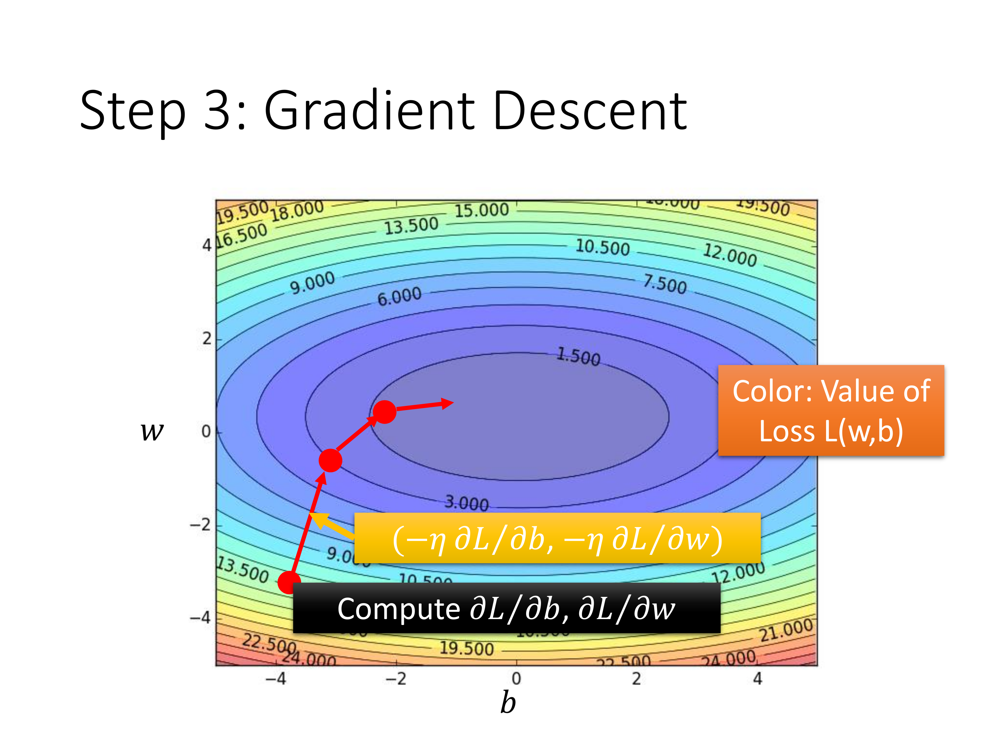
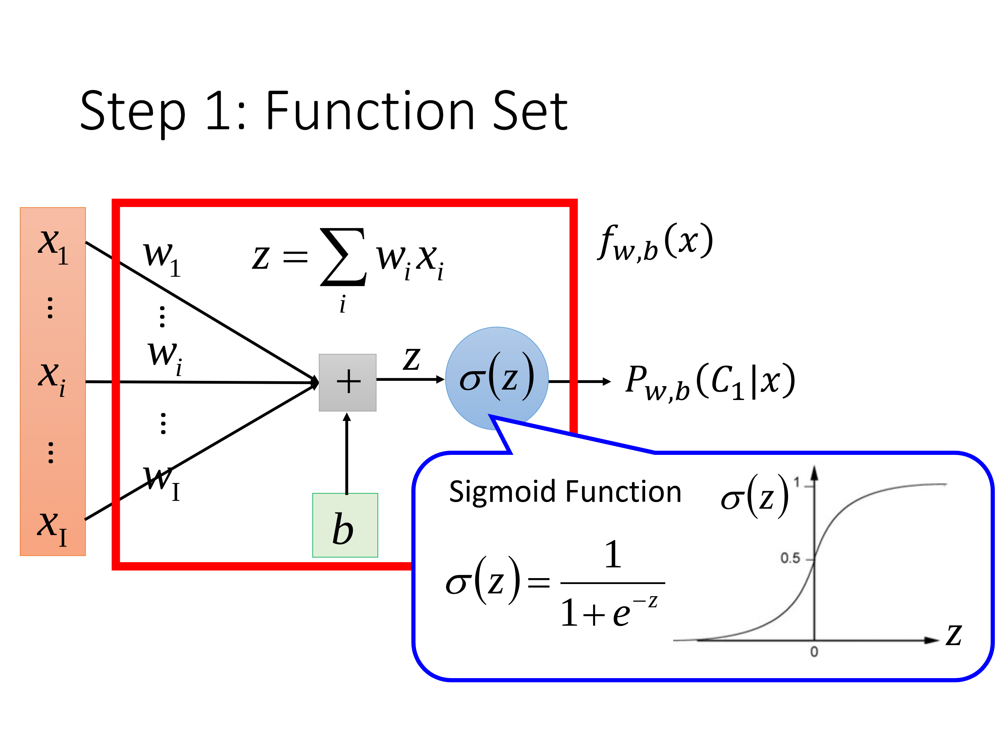
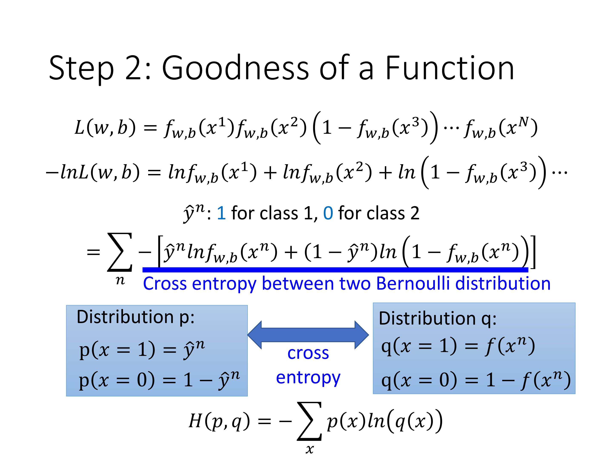
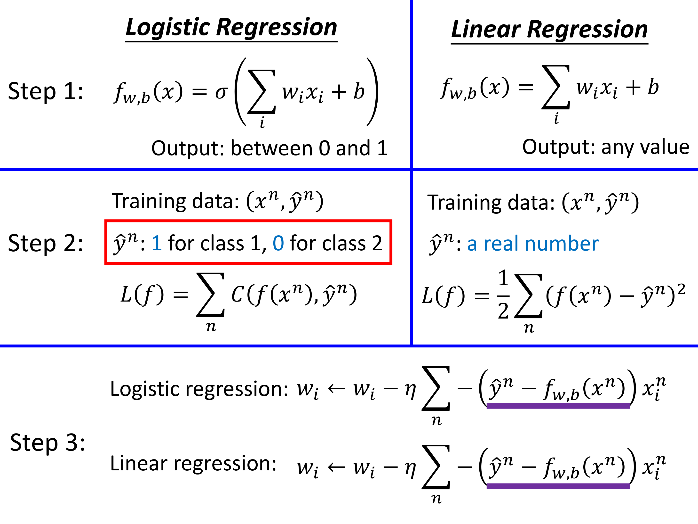
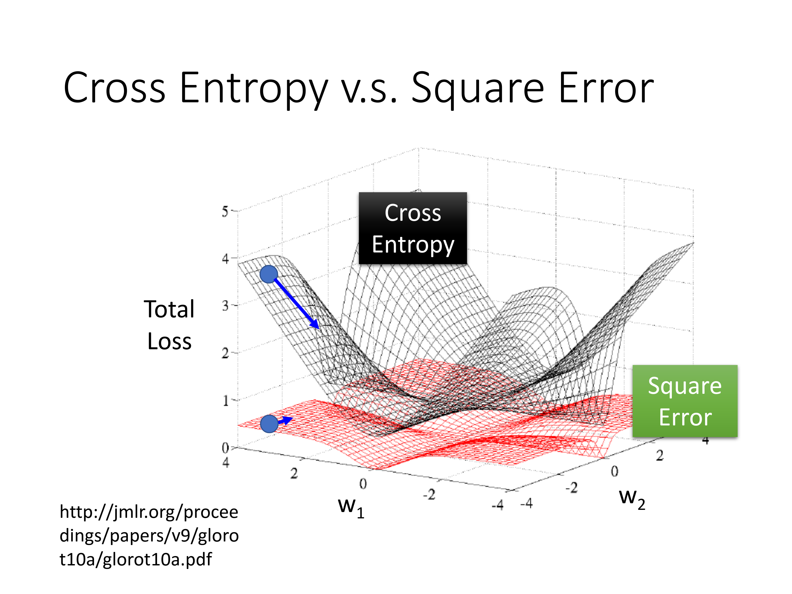
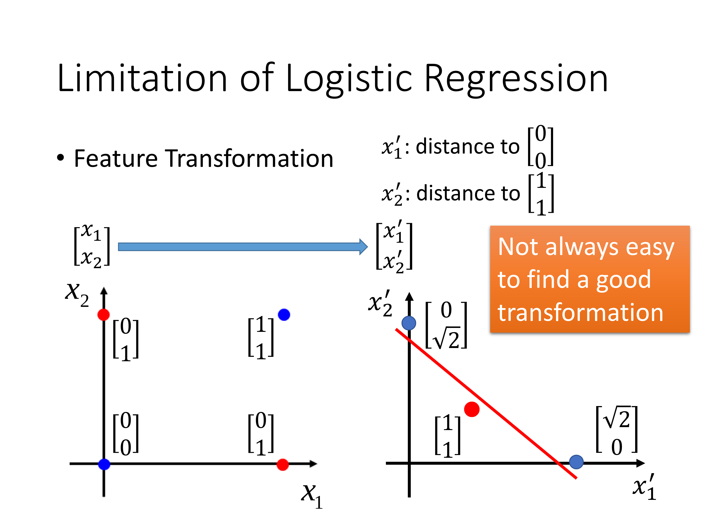
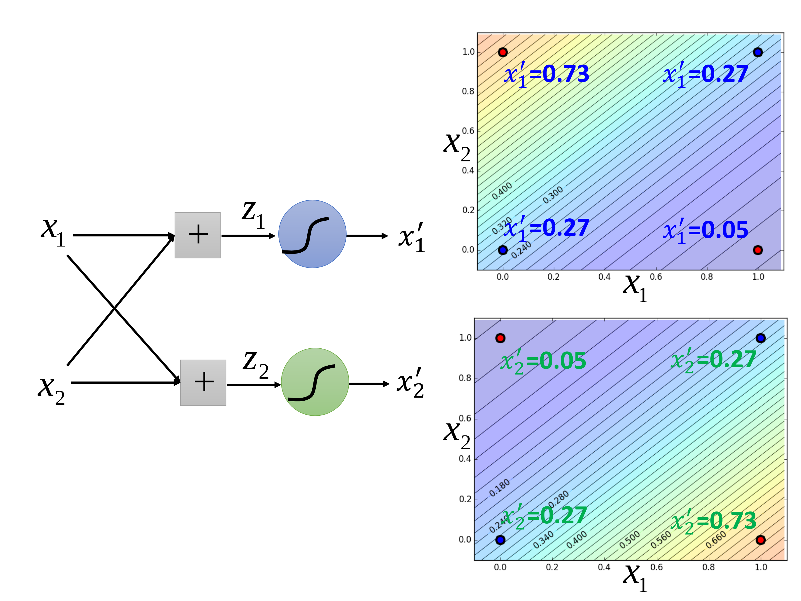
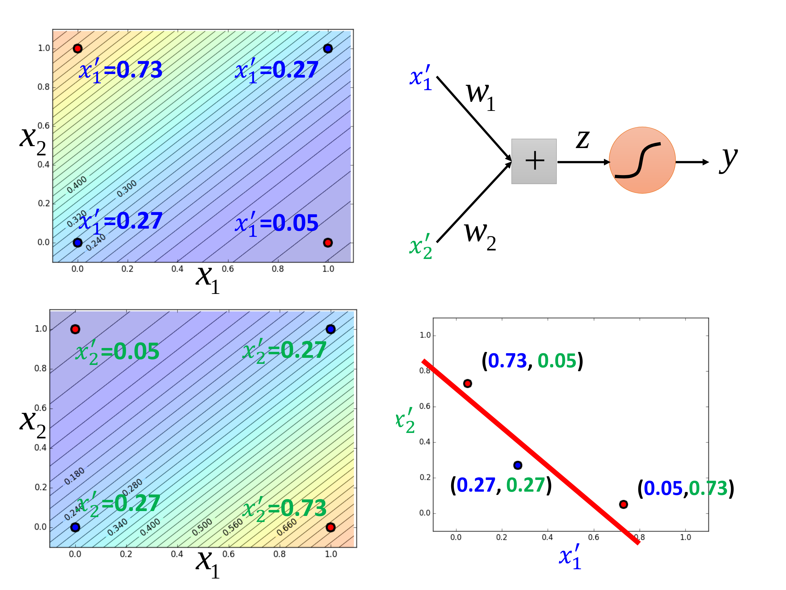

[TOC]
# Regerssion

> step 1:Model(consist of many possible founctions)
>
> step 2:Loss founction(define a loss to obtaion a best founction)
>
> step 3:best founction(w,b)

## Gradient Descent

损失函数：$L(w,b) = \sum_{i=1}^n(y -(wx+b))^2$

策略：$w*=arg min_w L(w)$

步骤：更新$w$   

> $w_1=w_0-\eta \frac{dL}{dw}|_{w=w_0 } $
>
> $w_2 = w_1 -\eta \frac{dL}{dw}|_{w=w_1}$

当$\frac {dL}{dw}$持续为0或者等于0时停止，选择此时的$w$就是使$L(w)$最小的$w$

同理，对于一次模型$y=wx+b$求解$\color{navy} best \quad founction$

$\begin{bmatrix}{\partial L \over \partial w}\\{\partial L \over \partial b}\\ \end{bmatrix}_{gradient} $

## some tips
+ 尚未到达局部最优或全局最优 出现梯度下降缓慢（very slow at the plateau)
+ 鞍点(stuck at saddle point)
+ 模型过于复杂，在training data 上完全准确率极高，但在test data 数据上准确率极低，过拟合(over fitting)
+ notice hidden factors $ ->$建立多个表达模型
+ regularization(L1 L2)
+ learning rate 与收敛时间，快慢，是否收敛有关
+ adaptive learning rates
+ bias and varience
+ cross validation

# Logistic Regerssion

$\delta (z) =\frac {1}{1+exp(-z)} $

## some tips
### 线性不可分问题
1. 映射到线性可分空间上

2. 多个神经元计算（本质上也是一种映射）由此引入神经网络雏形

