# MVDepthNet

## 1.目的

**==深度图　－>　稠密点云==**

##  2.单目深度估计

**几何原理**：通过二维图像点的对应关系，恢复出在两帧之间摄像机的运动，进而求得深度值。

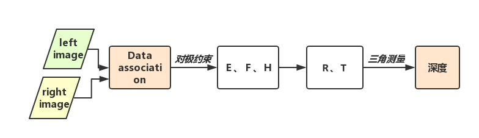

**深度学习**：假设我们有一张$$2d$$图片$$I$$  ,我们需要一个函数$$F$$来求取其相对应的深度 $$d$$．这个过程可以写为：
$d=F(I)$

### (1)[Depth Map Prediction from a Single Image using a Multi-Scale Deep Network (2014 NIPS)](http://link.zhihu.com/?target=https%3A//arxiv.org/pdf/1406.2283.pdf)

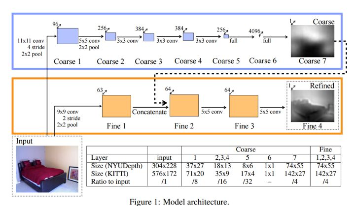

1. 这篇文章采用了一个multi-scale的结构来进行深度预测，可知在Coarse网络pre-trained之后与Fine网络进行连接能够促使神经网络的输出得到更好的效果
2. 使用Coarse网络去预测整体趋势，使用Fine网络在整体趋势上进行**局部调优**．
3. 这篇文章得到的深度尺寸均小于原图，作比较时，先将得到的深度图采用线性差值还原到与输入图片尺寸相同，再进行比较．其实这里有一个trade-off,　预测得到的小深度图的一个像素点能够代表当前位置的信息整体的深度使得RMSE(Root Mean Square Error)更小，但同时又会失去很多深度细节．
4. 关于损失函数, 首先作者采用的是**==log域上==**的比较，因为在深度估计时，相机拍摄到的物体更趋向于一个log分布，即拍摄到的照片中的物体更多集中在深度较浅区域，深度较深的区域在图像中会比较小（少）．

$$y$$    是真实的深度，$$y*$$    是合成的深度，$$i,j$$     分别为深度图中的某一对像素点

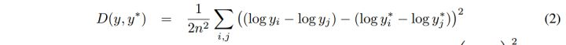

5. 之所以作者会使用这样复杂的损失函数，除了作者所提到的scale-invariant，我觉得还有一个原因就是在一张二维照片中，所提取到的深度信息其实更需要依靠点与点之间的关系(上图公式中后半部分）．这就牵扯到了一个相对深度的概念，关于这部分会在之后介绍[NIPS2016](http://link.zhihu.com/?target=http%3A//www-personal.umich.edu/%7Ewfchen/depth-in-the-wild/)这篇文章中讨论．

### (2)[Deeper Depth Prediction with Fully Convolutional Residual Networks(FCRN)](http://link.zhihu.com/?target=https%3A//arxiv.org/pdf/1606.00373.pdf)

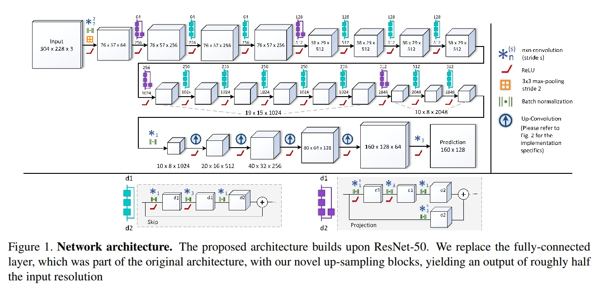

 **pretrained的ResNet50结构**

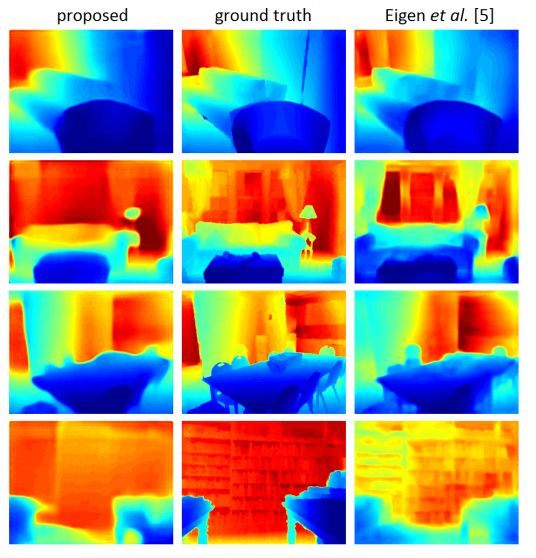
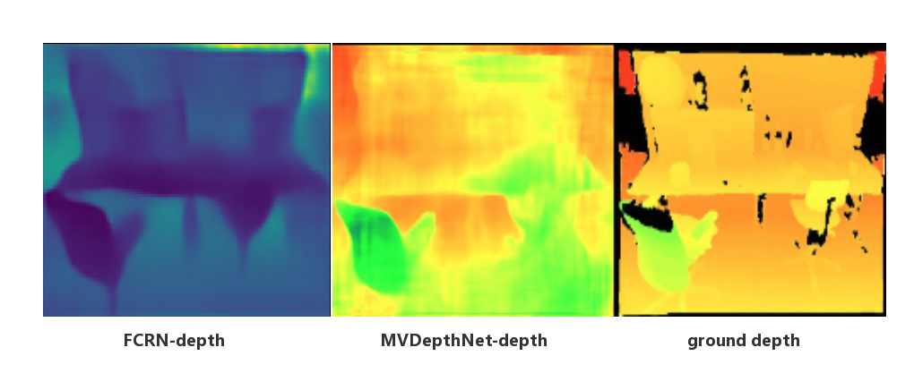
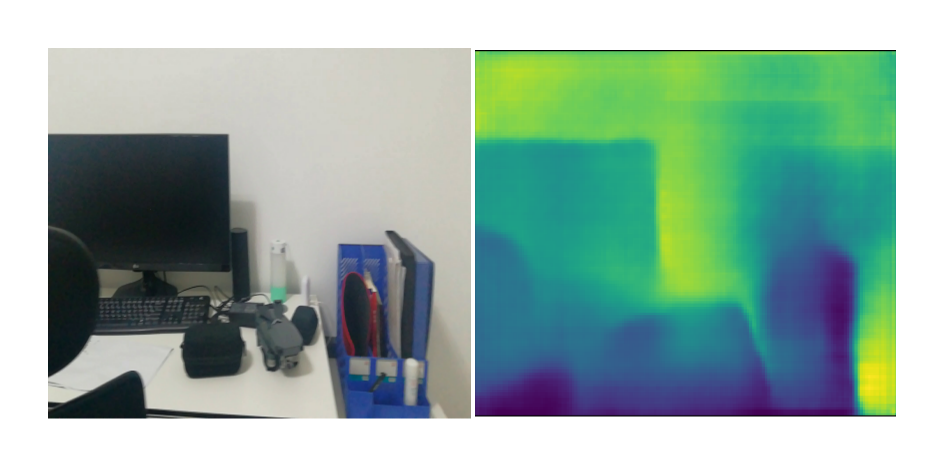

+ proposed为FCRN的方法，右图为eigen的方法，可见，虽然FCRN在整体的深度预测上表现的更好(使用了更深的ResNet50网络)，而Eigen的细节要丰富一点(使用了VGG16)，而且轮廓要更锋利一点．
+ Loss: ==Huber Loss==

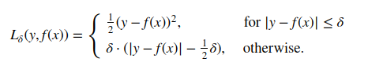

$$δ $$是 Huber　Loss 的参数，$$y$$是真实值，$$f(x)$$是模型的预测值, 且由定义可知 Huber Loss 处处可导

当预测偏差小于 δ 时，它采用平方误差,
　　当预测偏差大于 δ 时，采用的线性误差.
　　可以增强平方损失函数(MSE)对离群点的鲁棒性

+ ResNet  捕捉更多的全局信息
+ 没有训练代码，网络结构，Ｌｏｓｓ可以借鉴
+ 使用小卷积代替大卷积，实现上采样。传统的反卷积以及双线性插值存在问题: 反卷积，得到的结果存在很强的棋盘效应。双线性插值，得到的结果边缘模糊，噪声很大。FCRN中采用小卷积代替大卷积，一方面，可以使棋盘效应降低，一方面，尽量的保留边缘信息。 
+ 双线性插值：考虑待测样点周围四个直接邻点灰度值的影响, 而未考虑到各邻点间灰度值变化率的影响, 因此具有**低通滤波器**的性质, 从而导致缩放后图像的高频分量受到损失, **图像边缘在一定程度上变得较为模糊**。(MVDepthNet up_conv_layer 双线性插值)

### MVDepthNet 的Loss
$$L =\sum_{s=0} ^3\frac{1}{n_s}\sum_i|ξ_{si} − \frac{1}{d ˆ _{si}}|$$

**L1范数**，(绝对值MAE)在误差接近０的时候不平滑，梯度不变，即使对于很小的损失，梯度也很大，不利于模型收敛(变化的学习率);

**L2范数**，(平方MSE）对异常点会赋予较大的权重，如果异常点不属于考虑范围，是由于某种错误导致的，则此函数指导方向将出现偏差;

**Huber loss**,当误差在$$[0-δ,0+δ]$$之间时，等价为MSE，而在$$[-∞,δ]和[δ,+∞]$$时为MAE，在最优点附近由于调整为MSE，梯度更新会随着误差减小而减小，有利于收敛.

### 问题？

如何在保留细节的基础上得到更好的整体效果？

（１）求深度图和图像语义分割有一定的相关性，语义分割中的解决方法：基于图论的条件随机场==**CRF**==

[Conditional Random Fields as Recurrent Neural Networks（CRFasRNN 2015 ICCV)](http://link.zhihu.com/?target=http%3A//www.robots.ox.ac.uk/%7Eszheng/papers/CRFasRNN.pdf)

（２）==**GeoNet**==的平滑损失函数：

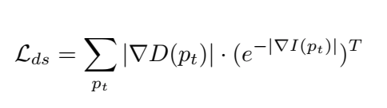
GeoNet代码中是对深度求一阶导，乘以对image权值的约束，指数函数，像素值变化越快权值越小，反之权值越大(相当于**自适应调整权值**)，sfm-learner,是对深度求二阶导，没有了image的约束。

loss : 求log

（３）pretrained

## 3. MVdepthNet

### (1) Model(pytorch)

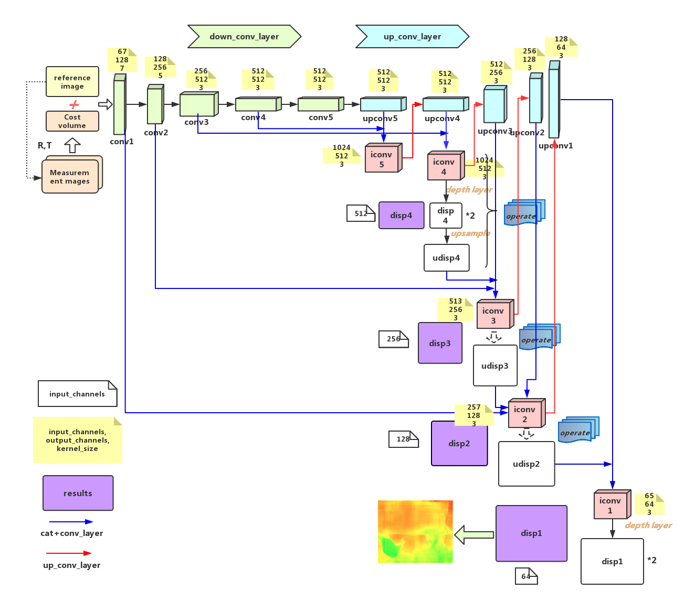

#### 网络组成：

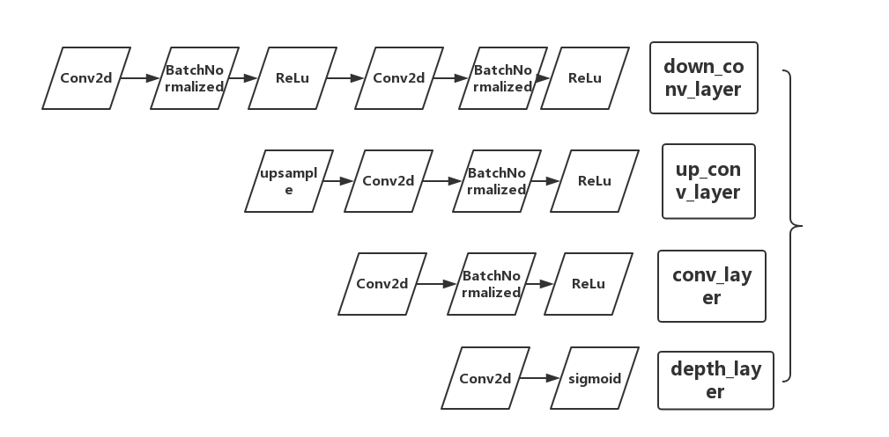

##### batchnormalized作用：

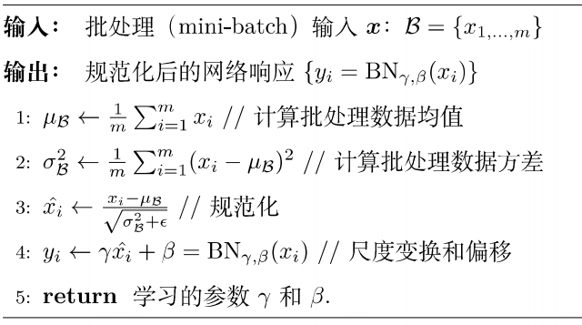
如上图所示，BN步骤主要分为4步：

1.求每一个训练批次数据的均值

2.求每一个训练批次数据的方差

3.使用求得的均值和方差对该批次的训练数据做归一化，获得0-1分布。其中\(\varepsilon\)是为了避免除数为0时所使用的微小正数。

4.尺度变换和偏移$x_{i}$$乘以$$\gamma$$调整数值大小，再加上$$$\beta$$增加偏移后得到$$y_{i}$$，这里的$$\gamma$$是尺度因子，$$\beta$$是平移因子。这一步是BN的精髓，由于归一化后的$$x_{i}$$基本会被限制在正态分布下，使得网络的表达能力下降。为解决该问题，我们引入两个新的参数：$$\gamma$$,$$\beta$$。 $$\gamma$$和$$\beta$$是在训练时网络自己学习得到的。

那么为什么要有第4步，不是仅使用减均值除方差操作就能获得目的效果吗？我们思考一个问题，减均值除方差得到的分布是正态分布，我们能否认为正态分布就是最好或最能体现我们训练样本的特征分布呢？不能，比如数据本身就很不对称，或者激活函数未必是对方差为1的数据最好的效果，比如Sigmoid激活函数，在-1~1之间的梯度变化不大，那么非线性变换的作用就不能很好的体现，换言之就是，减均值除方差操作后可能会削弱网络的性能！针对该情况，在前面三步之后加入第4步完成真正的batch normalization。

BN的**本质就是利用优化变一下方差大小和均值位置，使得新的分布更切合数据的真实分布，保证模型的非线性表达能力**。BN的极端的情况就是这两个参数等于mini-batch的均值和方差，那么经过batch normalization之后的数据和输入完全一样，当然一般的情况是不同的。

#### 激活函数

**为什么要用激活函数？**

如果不用激励函数，每一层输出都是上层输入的线性函数，无论神经网络有多少层，输出都是输入的线性组合。 如果使用的话，激活函数给神经元引入了非线性因素，使得神经网络可以任意逼近任何非线性函数，这样神经网络就可以应用到众多的非线性模型中。

**只有depth layer 使用了sigmoid函数，其他都是ReLu函数为什么？**

##### sigmoid函数

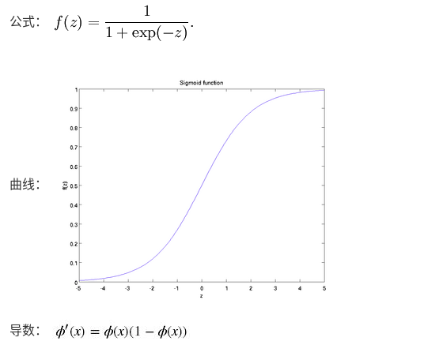

取值范围为(0,1)，它可以将一个实数映射到(0,1)的区间,**逆深度的取值为$$(0,1)$$之间**

**缺点**：

- 激活函数计算量大，反向传播求误差梯度时，求导涉及除法
- 反向传播时，很容易就会出现梯度消失的情况，从而无法完成深层网络的训练

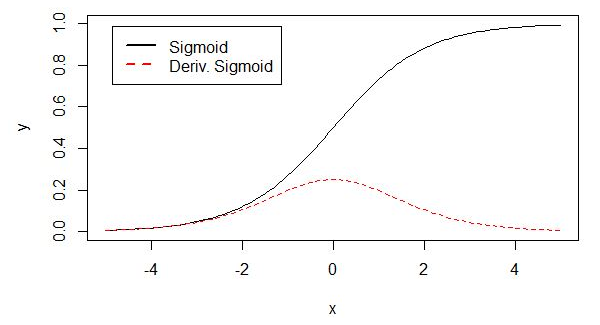
导数从零开始，很快又趋于零，易造成梯度消失。

##### ReLU 函数

用于隐层神经元输出

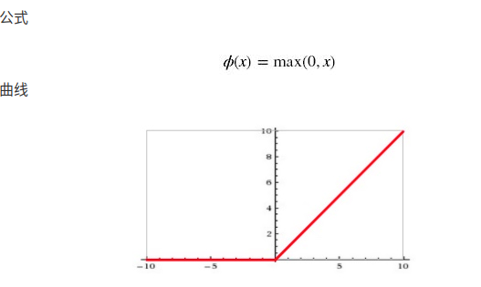

输入信号 <0 时，输出都是0，>0 的情况下，输出等于输入，收敛速度快

**缺点**：

训练的时候很”脆弱”，很容易就”die”了 例如，一个非常大的梯度流过一个 ReLU 神经元，更新过参数之后，这个神经元再也不会对任何数据有激活现象了，那么这个神经元的梯度就永远都会是 0. 如果 learning rate 很大，那么很有可能网络中的 40% 的神经元都”dead”了。

**对比**：

 1）relu单侧抑制 2）relu相对宽阔的兴奋边界 3）relu稀疏激活性。

#### 网络初始化：

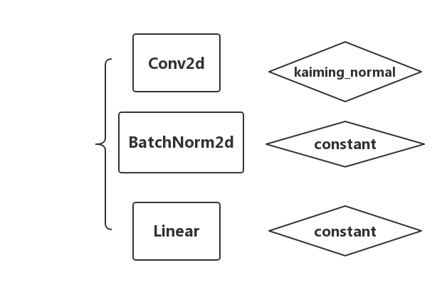
**kaiming_normal**针对于Relu的初始化方法
详细参考：https://blog.csdn.net/dss_dssssd/article/details/83959474
**constant**初始化为常数

#### 网络设计

##### down_conv_layer(==encoder==):

+ extract global information of the reference image
+ aggregate high-level pixel costs

##### up_conv_layer(==decoder==):

**upsampled －> finer resolutions**

+ keep the low-level per-pixel information
+ the finest resolution the same as input reference image
+ ==skip connections －> combine low-level cost and high-level image information==

##### cost volume

+ shape : 1x64x256x320
+ per-pixels compute costvolume (for inverse depth_i in 64)
+ advantages 1: per-pixel matching cost is much ==more efficient to calculate== and extend to multiple measurement images
+ advantages 2 : without a supporting window ,the ==detail information== can be preserved

## 4.点云

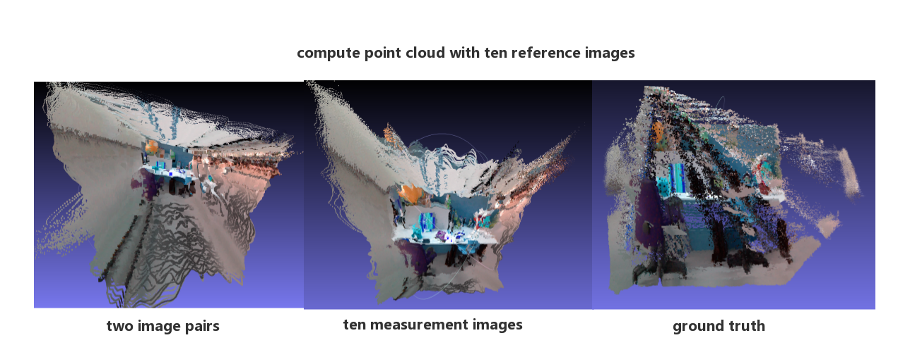

+ 过程：杂点过多完全看不清，检查ＲＴ是否错误，检查点云计算过程是否正确，测试ground truth 的点云结果后，呈金字塔样子，发现是==K==的问题，因为输入图片进行resize但是Ｋ没有改变
+ 多张计算cost volume 后，单张的额深度图没有很明显的改善，但是总体结果变好，深度计算结果更加稳定；点云计算结果杂点少了很多，少了很多误差很大的点。
+ 问题： 
  + 边缘存在扭曲，细节挺好的，深度图问题——> 深度图优化
  + ground truth 没有点云过滤

