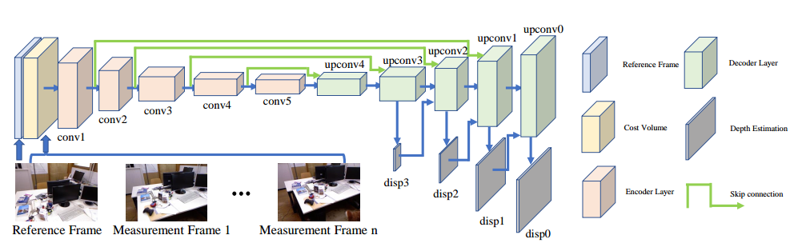
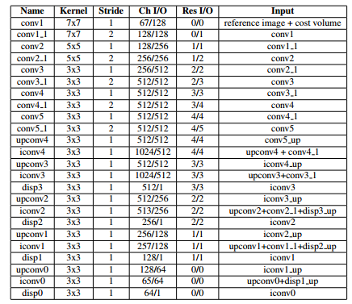
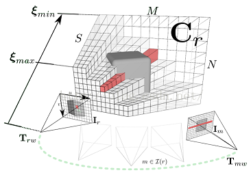
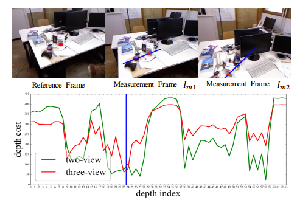
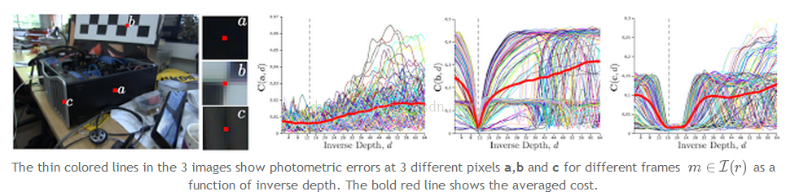

[TOC]
## MVDepthNet  Paper

### 一. 一些符号


##### 1. 坐标变换：

$$
T_{wc} = 
\begin{pmatrix}
R_{wc} & t_w \\
\mathbf{0}^T  & 1
\end{pmatrix}
$$

变换关系为 $X_w = T_{wc}X_c$


##### 2. 透视变换(Perspective Projection)：

对于3D点$\mathbf{x_c} = (x,y,z)^T$ 变换到图像坐标的结果可以表示为：$\pi(\mathbf{x_c})$，与之对应反变换可以记作：$\pi^{-1}(\mathbf{u},d)$代表将图像坐标$\mathbf{u}$变换到对应的3D空间点。


#####  3. 其它论文中的一些符号：

关键帧一般采用$r$作为下标，$\xi_r$ 代表一个映射关系，可以给定一个像素坐标$\mathbf{u}$ 将其映射到对应的逆深度(inverse depth)，即：$d=\xi(\mathbf{u})$ ，$I_r$表示帧r对应的RGB图像。

其中，$\pi (x,y,z)=(x/z,y/z)$

$2D\Rightarrow3D$点的映射关系可以写作：
$$
X=\pi^{-1}(\mathbf{u},d)  \\
\pi^{-1}(\mathbf{u},d) = \frac{1}{d} K^{-1}\mathbf{\dot{u}} \\
\mathbf{\dot{u}} = (u,v,1)^T
$$


### 二. architecture of MVDepthNet




+ 为什么要 skip connettions between the encoder nad decoder?

  skip connections ：`combine low-level cost and high-level information`.

1. encoder : extract global information of the image and aggregate high-level pixel costs.
2. decoder ：  extracted global and high-level information is then upsampled into finer resolutios
skip connections ：`combine low-level cost and high-level information`.
detailed definition:



#### 1. Cost Volume的概念

> 符号$\mathbf{\mathcal{I}_r}$表示在帧r附近与r具有较多重叠视角的图像帧的集合，或者理解成视频中帧r的前后几十或者几百帧构成的集合

目标是利用一系列`base_line`较小的图像(重叠较多，变化不大)去估计出映射关系$\xi_r$ 。简单说就是获取帧r每个像素对应的逆深度值，也就是获取深度图，(可以按照这么理解，符号介绍中解释了$\xi_r$的含义)。

#### 2. 定义cost volume

对于帧r,我们把它的cost volume 记做$\mathbf{C_r}$，`A row of `$C_r(\mathbf{u})$ 存储着光度误差的累计值。是一个关于逆深度$d$的函数。

平均光度误差的含义：把3D点分别投影到集合$\mathcal{I}_r$中的每一帧中，求取其对应的误差，并求和取平均得到的结果。

具体计算公式如下：
$$
C_r(\mathbf{u},d)  = \frac{1}{|\mathcal{I_r}|} \sum_{m\in \mathcal{I}_r}|| \rho_r(\mathbf{I}_m,\mathbf{I}_r\mathbf{u},d)||_1
$$
对于每一张图的光度误差定义为：
$$
\rho(\mathbf{I}_m,\mathbf{I}_r,\mathbf{u},d) = \mathbf{I}_r( \mathbf{u}) - \mathbf{I}_m(\pi(KT_{mr}\pi^{-1}(\mathbf{u},d)))
$$
根据亮度一致性假设，我们希望物体表面的点的逆深度对应的$\rho$最小，通过最小化误差函数，便可以最终求得每一个像素对应的逆深度$d$。

#### 3. 图的解释



关键帧$r$由如下几部分构成：$I_r$表示RGB图像、姿态$T_{rw}$、cost volume $C_r$

关键帧中的每一个像素都对应着$C_r$中的一列(row  ) $C_r(\mathbf{u})$，对应图中$I_r$对应的那些红色方块。

存储着前文所说的平均光度误差值。具体存储方式如下：

将$[\xi_{min},\xi_{max}]$离散化，分成$S$份，那么整个cost volume可以看做一个$M\times N\times S$份的立方体集合，每个像素$(u,v)$对应着$S$个，小立方体，即图中左边红色的那条。

#### 为什么采用cost volume？


+ 由于单帧的代价体积存在很多噪声，故采用多帧的平均光测误差作为代价体积


蓝色竖线为真实深度，两张在蓝线处depth cost不是全局最小，three_view时是。




### 三. 一些函数参数的定义

#### 1. inverse depth

$\frac{1}{d} = ( \frac{1}{d_{min}} −\frac{1}{d{max}})\frac{i}{N_d− 1} +\frac{1}{d_{max} } $

+ $N_d$ 为将逆深分成的份数

#### 2. loss founction

$L =\sum_{s=0} ^3\frac{1}{n_s}\sum_i|ξ_{si} − \frac{1}{d ˆ _{si}}|$

+ $s$：scale (different resolutions)
+ 采用$L_1$
+ $n_s$ : the number of the pixels at scale s
+ $ξ_{si}$ :  estimated inverse depth at scale s
+ $ d ˆ _{si} $ : ground truth

#### 3.  sigmoid 函数

Since the estimated inverse depth is bounded between 0 and 1/dmin, a `scaled sigmoid function` is used to constrain the output range. 

## MVDepthNet  code

### depthNet_model.py

```python
torch.nn.Sequential() 
```

是一个`Sequential`容器，模块将按照构造函数中传递的顺序添加到模块中。另外，也可以传入一个有序模块。可以用于快速搭建，

- 使用`torch.nn.Module`，我们可以根据自己的需求改变传播过程，如`RNN`等
- 如果你需要快速构建或者不需要过多的过程，直接使用`torch.nn.Sequential`即可。

```python
F.grid_sample
```
实现对每个样本的feature map进行裁剪。

```python
np.squeeze() #删除某一单维度条目
np.clip() # 将元素限制在某范围之间
np.expand_dims() # 扩充维度
np.repeat() # 按某种方式重复
np.concatenate() # 将多个数组连接
np.indices([320,256]) # 建造一个320x256 大小的矩阵
torch.cat() # 按行或者列放在一起
astype() # 转换数据类型
permute() # 按维度的一定顺序排列

```


