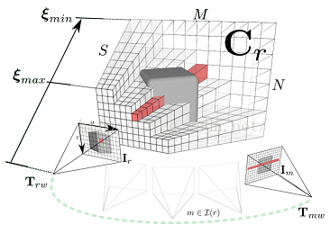

[TOC]

## 一.  Outline

+ DenseDepth：`单张出深度` `迁移学习`  ==没有几何信息==
+ MvDepthNet：`costvolume` `两张或多张`  ==边缘过于平滑，空间离散带来的误差==   ==训练太消耗内存==
+ MVSNet：`costvolume`  ==训练消耗内存==
+ R-MVSNet：解决内存消耗问题
+ sparse-to-dense：
**结果对比**

.jpg)
## 二. DenseDepth

### 1. overview of network

### 2. Loss founction

$$
L(y, y*) = λLdepth(y, y^*) + Lgrad(y, y^*) + LSSIM (y, y^*)
$$

$$
Ldepth(y, y^*) = \frac{1}{n} \sum_{p}^n|y_p -y^*_p|
$$

$$
Lgrad(y; y ^) = \frac{1}{n} \sum_{p}^n|g_x(y_p,y^*_p)|+|g_y(y_p,y^*_p)|
$$

$$
LSSIM (y, y^*) = \frac{1 − SSIM(y, y^*)}{2}
$$

$$
SSIM(x,y)=[l(x,y)]^α[c(x,y)]^β[s(x,y)]^γ
$$

$$
l(x,y)=\frac{2μ_x μ_y+c_1}{μ_x^2+μ_y^2+c1}
$$

$$
c(x,y)=\frac{2σ_{xy}+c_2}{σ_x^2+σ_y^2+c_2}
$$

$$
s(x,y)=\frac{σ_{xy}+c3}{σ_xσ_y+c3}
$$

### 3. 问题

+ 室内数据泛化能力很好，深度图点云都很好，自己拍的数据同样结果不错
+ 给的NYU数据训练同样消耗很多内存，4.4GB数据一块GPU预计训练十几天

+ Loss 很大然后为nan, 不一定是参数问题，也可能是数据问题，训练数据有很多空洞 ，将空洞设置为mask
+ mask在传递过程中值也会变，不是简单的mask掉，在Numpy计算的时候，会把mask视为无穷大的值，然后程序中的np.clip()又把mask变为一个边界最值，所以导致影响很大！
+ 可视化的时候直接用原始程序中`plt.get_cmap('plasma')` 可视化不出来结果，可能是深度值范围区别太大导致
+ 采用无空洞的数据进行训练，结果还是很不好，猜测数据变化太大，或者是该程序没有用到任何几何信息，对于航拍图不可用，猜测网络前段的迁移学习用到的数据可能对室内场景更有效？kitti数据集下结果同样不错，与深度值分布有关？

## 三. MVDepthNet

### 1. overview of network

### 2. costvolume(DTAM)

**亮度一致性假设**

平均光度误差：
$$
C_r(\mathbf{u},d)  = \frac{1}{|\mathcal{I_r}|} \sum_{m\in \mathcal{I}_r}|| \rho_r(\mathbf{I}_m,\mathbf{I}_r\mathbf{u},d)||_1
$$
每一张图的光度误差：
$$
\rho(\mathbf{I}_m,\mathbf{I}_r,\mathbf{u},d) = \mathbf{I}_r( \mathbf{u}) - \mathbf{I}_m(\pi(KT_{mr}\pi^{-1}(\mathbf{u},d)))
$$

希望物体表面的点的逆深度对应的$\rho$最小，通过最小化误差函数，便可以最终求得每一个像素对应的逆深度$d$。

多帧代价误差，因为单帧存在噪声

### 3. Loss founction

$$
L =\sum_{s=0} ^3\frac{1}{n_s}\sum_i|ξ_{si} − \frac{1}{d ˆ _{si}}|
$$

$$
\frac{1}{d} = ( \frac{1}{d_{min}} −\frac{1}{d{max}})\frac{i}{N_d− 1} +\frac{1}{d_{max} }
$$

### 4. 问题

+ 深度值边缘
+ 训练消耗过多内存

## 四. MVSNet and RMVSNet

MVSNet -> RMVSNet : 

单应矩阵<https://www.cnblogs.com/wangguchangqing/p/8287585.html>

网络解释：<https://blog.csdn.net/john_xia/article/details/88100410>