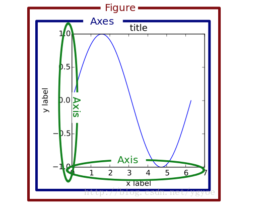

**1. pyplot和pylab的区别** 

pyplot模块提供了一套和MATLAB类似的绘图API。pylab模块，**包括了许多NumPy和pyplot模块中常用的函数**，方便用户快速进行计算和绘图。可以从pylab的源码中看出来：

**2. pyplot****模块里的函数**

 **2.1**  **函数汇总**

（详见  <https://matplotlib.org/api/pyplot_summary.html>）

| **函数**                                              | **说明**                                                     |
| ----------------------------------------------------- | ------------------------------------------------------------ |
| **acorr(x[, hold, data])**                            | Plot the autocorrelation of *x*.                             |
| **angle_spectrum(x[, Fs, Fc, window, pad_to, …])**    | Plot the angle spectrum.画角谱图（信号处理，光学）           |
| **annotate(\*args, **kwargs)**                        | Annotate the point xy with text s. 给图片添加注释（可指定被注释的位置，用于注释的字符串位置） |
| **arrow(x, y, dx, dy[, hold])**                       | Add an arrow to the axes.给坐标轴添加箭头                    |
| **autoscale([enable, axis, tight])**                  | Autoscale the axis view to the data (toggle).                |
| **autumn()**                                          | Set the colormap to “autumn”.将colormap设置成autumn          |
| **axes([arg])**                                       | Add an axes to the current figure and make it the current axes. |
| **axhline([y, xmin, xmax, hold])**                    | Add a horizontal line across the axis.沿着坐标轴添加一条水平线 |
| **axhspan(ymin, ymax[, xmin, xmax, hold])**           | Add a horizontal span (rectangle) across the axis.沿着坐标轴添加一条水平矩形 |
| **axis(\*v, **kwargs)**                               | Convenience method to get or set axis properties.            |
| **axvline([x, ymin, ymax, hold])**                    | Add a vertical line across the axes.沿着坐标轴添加一条竖直线条 |
| **axvspan(xmin, xmax[, ymin, ymax, hold])**           | Add a vertical span (rectangle) across the axes.沿着坐标轴添加一条竖直矩形 |
| **bar(\*args, **kwargs)**                             | Make a bar plot.绘制bar                                      |
| **barbs(\*args, **kw)**                               | Plot a 2-D field of barbs.                                   |
| **barh(\*args, **kwargs)**                            | Make a horizontal bar plot.绘制水平bar                       |
| **bone()**                                            | Set the colormap to “bone”.将colormap设置成bone              |
| **box([on])**                                         | Turn the axes box on or off.                                 |
| **boxplot(x[, notch, sym, vert, whis, …])**           | Make a box and whisker plot.                                 |
| **broken_barh(xranges, yrange[, hold, data])**        | Plot a horizontal sequence of rectangles.                    |
| **cla()**                                             | Clear the current axes.清除当前坐标                          |
| **clabel(CS, \*args, **kwargs)**                      | Label a contour plot.                                        |
| **clf()**                                             | Clear the current figure.**清除当前图像**（用一个figure连续绘制不同图时可能会用到） |
| **clim([vmin, vmax])**                                | Set the color limits of the current image.                   |
| **close(\*args)**                                     | Close a figure window.                                       |
| **cohere(x, y[, NFFT, Fs, Fc, detrend, …])**          | Plot the coherence between *x* and *y*.                      |
| **colorbar([mappable, cax, ax])**                     | Add a colorbar to a plot.添加colorbar                        |
| **colors()**                                          | .                                                            |
| **connect(s, func)**                                  | Connect event with string *s* to *func*.                     |
| **contour(\*args, **kwargs)**                         | Plot contours.绘制contour图（与MATLAB中的类似）              |
| **contourf(\*args, **kwargs)**                        | Plot contours.                                               |
| **cool()**                                            | Set the colormap to “cool”.                                  |
| **copper()**                                          | Set the colormap to “copper”.                                |
| **csd(x, y[, NFFT, Fs, Fc, detrend, window, …])**     | Plot the cross-spectral density.                             |
| **delaxes([ax])**                                     | Remove the given Axes *ax* from the current figure.          |
| **disconnect(cid)**                                   | Disconnect callback id cid                                   |
| **draw()**                                            | Redraw the current figure.                                   |
| **errorbar(x, y[, yerr, xerr, fmt, ecolor, …])**      | Plot y versus x as lines and/or markers with attached errorbars. |
| **eventplot(positions[, orientation, …])**            | Plot identical parallel lines at the given positions.        |
| **figimage(\*args, **kwargs)**                        | Adds a non-resampled image to the figure.                    |
| **figlegend(\*args, **kwargs)**                       | Place a legend in the figure.                                |
| **fignum_exists(num)**                                |                                                              |
| **figtext(\*args, **kwargs)**                         | Add text to figure.                                          |
| **figure([num, figsize, dpi, facecolor, …])**         | Creates a new figure.                                        |
| **fill(\*args, **kwargs)**                            | Plot filled polygons.                                        |
| **fill_between(x, y1[, y2, where, …])**               | Fill the area between two horizontal curves.                 |
| **fill_betweenx(y, x1[, x2, where, step, …])**        | Fill the area between two vertical curves.                   |
| **findobj([o, match, include_self])**                 | Find artist objects.                                         |
| **flag()**                                            | Set the colormap to “flag”.                                  |
| **gca(\**kwargs)**                                    | Get the current [Axes](https://matplotlib.org/api/axes_api.html#matplotlib.axes.Axes) instance on the current figure matching the given keyword args, or create one. |
| **gcf()**                                             | Get a reference to the current figure.                       |
| **gci()**                                             | Get the current colorable artist.                            |
| **get_current_fig_manager()**                         |                                                              |
| **get_figlabels()**                                   | Return a list of existing figure labels.                     |
| **get_fignums()**                                     | Return a list of existing figure numbers.                    |
| **get_plot_commands()**                               | Get a sorted list of all of the plotting commands.           |
| **ginput(\*args, **kwargs)**                          | Blocking call to interact with a figure.                     |
| **gray()**                                            | **Set the colormap to “gray”.****将colorbar设置成gray**      |
| **grid([b, which, axis])**                            | Turn the axes grids on or off.                               |
| **hexbin(x, y[, C, gridsize, bins, xscale, …])**      | Make a hexagonal binning plot.                               |
| **hist(x[, bins, range, density, weights, …])**       | Plot a histogram.                                            |
| **hist2d(x, y[, bins, range, normed, weights, …])**   | Make a 2D histogram plot.                                    |
| **hlines(y, xmin, xmax[, colors, linestyles, …])**    | Plot horizontal lines at each *y* from *xmin* to *xmax*.     |
| **hold([b])**                                         | .                                                            |
| **hot()**                                             | Set the colormap to “hot”.                                   |
| **hsv()**                                             | Set the colormap to “hsv”.                                   |
| **imread(\*args, **kwargs)**                          | Read an image from a file into an array.                     |
| **imsave(\*args, **kwargs)**                          | Save an array as in image file.                              |
| **imshow(X[, cmap, norm, aspect, …])**                | Display an image on the axes.                                |
| **inferno()**                                         | Set the colormap to “inferno”.                               |
| **install_repl_displayhook()**                        | Install a repl display hook so that any stale figure are automatically redrawn when control is returned to the repl. |
| **ioff()**                                            | **Turn interactive mode off.****交互模式关**                 |
| **ion()**                                             | Turn interactive mode on.**设置交互模式开**                  |
| **ishold()**                                          | .                                                            |
| **isinteractive()**                                   | Return status of interactive mode.                           |
| **jet()**                                             | **Set the colormap to “jet”.**                               |
| **legend(\*args, **kwargs)**                          | **Places a legend on the axes.****添加legend**               |
| **locator_params([axis, tight])**                     | Control behavior of tick locators.                           |
| **loglog(\*args, **kwargs)**                          | Make a plot with log scaling on both the *x* and *y* axis.   |
| **magma()**                                           | Set the colormap to “magma”.                                 |
| **magnitude_spectrum(x[, Fs, Fc, window, …])**        | Plot the magnitude spectrum.                                 |
| **margins(\*args, **kw)**                             | Set or retrieve autoscaling margins.                         |
| **matshow(A[, fignum])**                              | Display an array as a matrix in a new figure window.         |
| **minorticks_off()**                                  | Remove minor ticks from the current plot.                    |
| **minorticks_on()**                                   | Display minor ticks on the current plot.                     |
| **nipy_spectral()**                                   | Set the colormap to “nipy_spectral”.                         |
| **over(func, \*args, **kwargs)**                      | .                                                            |
| **pause(interval)**                                   | **Pause for interval seconds.****figure显示interval 秒再进行下面的操作** |
| **pcolor(\*args, **kwargs)**                          | Create a pseudocolor plot of a 2-D array.                    |
| **pcolormesh(\*args, **kwargs)**                      | Plot a quadrilateral mesh.                                   |
| **phase_spectrum(x[, Fs, Fc, window, pad_to, …])**    | Plot the phase spectrum.                                     |
| **pie(x[, explode, labels, colors, autopct, …])**     | Plot a pie chart.                                            |
| **pink()**                                            | Set the colormap to “pink”.                                  |
| **plasma()**                                          | Set the colormap to “plasma”.                                |
| **plot(\*args, **kwargs)**                            | Plot y versus x as lines and/or markers.                     |
| **plot_date(x, y[, fmt, tz, xdate, ydate, …])**       | Plot data that contains dates.                               |
| **plotfile(fname[, cols, plotfuncs, comments, …])**   | Plot the data in a file.                                     |
| **polar(\*args, **kwargs)**                           | Make a polar plot.                                           |
| **prism()**                                           | Set the colormap to “prism”.                                 |
| **psd(x[, NFFT, Fs, Fc, detrend, window, …])**        | Plot the power spectral density.                             |
| **quiver(\*args, **kw)**                              | Plot a 2-D field of arrows.                                  |
| **quiverkey(\*args, **kw)**                           | Add a key to a quiver plot.                                  |
| **rc(\*args, **kwargs)**                              | **Set the current rc params.****设置rc参数**                 |
| **rc_context([rc, fname])**                           | Return a context manager for managing rc settings.           |
| **rcdefaults()**                                      | Restore the rc params from Matplotlib’s internal defaults.   |
| **rgrids(\*args, **kwargs)**                          | Get or set the radial gridlines on a polar plot.             |
| **savefig(\*args, **kwargs)**                         | Save the current figure.                                     |
| **sca(ax)**                                           | Set the current Axes instance to *ax*.                       |
| **scatter(x, y[, s, c, marker, cmap, norm, …])**      | A scatter plot of *y* vs *x* with varying marker size and/or color. |
| **sci(im)**                                           | Set the current image.                                       |
| **semilogx(\*args, **kwargs)**                        | Make a plot with log scaling on the x axis.                  |
| **semilogy(\*args, **kwargs)**                        | Make a plot with log scaling on the y axis.                  |
| **set_cmap(cmap)**                                    | Set the default colormap.                                    |
| **setp(\*args, **kwargs)**                            | Set a property on an artist object.                          |
| **show(\*args, **kw)**                                | Display a figure.                                            |
| **specgram(x[, NFFT, Fs, Fc, detrend, window, …])**   | Plot a spectrogram.                                          |
| **spectral()**                                        | Set the colormap to “spectral”.                              |
| **spring()**                                          | Set the colormap to “spring”.                                |
| **spy(Z[, precision, marker, markersize, aspect])**   | Plot the sparsity pattern on a 2-D array.                    |
| **stackplot(x, \*args, **kwargs)**                    | Draws a stacked area plot.                                   |
| **stem(\*args, **kwargs)**                            | Create a stem plot.                                          |
| **step(x, y, \*args, **kwargs)**                      | Make a step plot.                                            |
| **streamplot(x, y, u, v[, density, linewidth, …])**   | Draws streamlines of a vector flow.                          |
| **subplot(\*args, **kwargs)**                         | Return a subplot axes at the given grid position.            |
| **subplot2grid(shape, loc[, rowspan, colspan, fig])** | Create an axis at specific location inside a regular grid.   |
| **subplot_tool([targetfig])**                         | Launch a subplot tool window for a figure.                   |
| **subplots([nrows, ncols, sharex, sharey, …])**       | Create a figure and a set of subplots                        |
| **subplots_adjust(\*args, **kwargs)**                 | Tune the subplot layout.                                     |
| **summer()**                                          | Set the colormap to “summer”.                                |
| **suptitle(\*args, **kwargs)**                        | Add a centered title to the figure.                          |
| **switch_backend(newbackend)**                        | Switch the default backend.                                  |
| **table(\**kwargs)**                                  | Add a table to the current axes.                             |
| **text(x, y, s[, fontdict, withdash])**               | Add text to the axes.                                        |
| **thetagrids(\*args, **kwargs)**                      | Get or set the theta locations of the gridlines in a polar plot. |
| **tick_params([axis])**                               | Change the appearance of ticks, tick labels, and gridlines.  |
| **ticklabel_format(\**kwargs)**                       | Change the [ScalarFormatter](https://matplotlib.org/api/ticker_api.html#matplotlib.ticker.ScalarFormatter) used by default for linear axes. |
| **tight_layout([pad, h_pad, w_pad, rect])**           | Automatically adjust subplot parameters to give specified padding. |
| **title(s, \*args, **kwargs)**                        | Set a title of the current axes.                             |
| **tricontour(\*args, **kwargs)**                      | Draw contours on an unstructured triangular grid.            |
| **tricontourf(\*args, **kwargs)**                     | Draw contours on an unstructured triangular grid.            |
| **tripcolor(\*args, **kwargs)**                       | Create a pseudocolor plot of an unstructured triangular grid. |
| **triplot(\*args, **kwargs)**                         | Draw a unstructured triangular grid as lines and/or markers. |
| **twinx([ax])**                                       | **Make a second axes that shares the x-axis.**               |
| **twiny([ax])**                                       | **Make a second axes that shares the y-axis.**               |
| **uninstall_repl_displayhook()**                      | Uninstalls the matplotlib display hook.                      |
| **violinplot(dataset[, positions, vert, …])**         | Make a violin plot.                                          |
| **viridis()**                                         | Set the colormap to “viridis”.                               |
| **vlines(x, ymin, ymax[, colors, linestyles, …])**    | Plot vertical lines.                                         |
| **waitforbuttonpress(\*args, **kwargs)**              | Blocking call to interact with the figure.                   |
| **winter()**                                          | Set the colormap to “winter”.                                |
| **xcorr(x, y[, normed, detrend, usevlines, …])**      | Plot the cross correlation between *x* and *y*.              |
| **xkcd([scale, length, randomness])**                 | Turns on [xkcd](https://xkcd.com/) sketch-style drawing mode. |
| **xlabel(s, \*args, **kwargs)**                       | Set the *x* axis label of the current axis.                  |
| **xlim(\*args, **kwargs)**                            | Get or set the *x* limits of the current axes.               |
| **xscale(\*args, **kwargs)**                          | Set the scaling of the *x*-axis.                             |
| **xticks(\*args, **kwargs)**                          | Get or set the *x*-limits of the current tick locations and labels. |
| **ylabel(s, \*args, **kwargs)**                       | Set the *y* axis label of the current axis.                  |
| **ylim(\*args, **kwargs)**                            | Get or set the *y*-limits of the current axes.               |
| **yscale(\*args, **kwargs)**                          | Set the scaling of the *y*-axis.                             |
| **yticks(\*args, **kwargs)**                          | Get or set the *y*-limits of the current tick locations and labels. |

 **2.2**  **确定坐标范围**

axis()命令给定了坐标范围：

plt.axis([xmin, xmax, ymin, ymax])



 

### 2.3 文本函数

- plt.xticks()/plt.yticks()  设置坐标轴的刻度显示的值。
- plt.legend()  添加图例
- [text()](https://matplotlib.org/api/pyplot_api.html#matplotlib.pyplot.text) - add text at an arbitrary location to the Axes; [matplotlib.axes.Axes.text()](https://matplotlib.org/api/_as_gen/matplotlib.axes.Axes.text.html#matplotlib.axes.Axes.text) in the API.
- [xlabel()](https://matplotlib.org/api/pyplot_api.html#matplotlib.pyplot.xlabel) - add a label to the x-axis; [matplotlib.axes.Axes.set_xlabel()](https://matplotlib.org/api/_as_gen/matplotlib.axes.Axes.set_xlabel.html#matplotlib.axes.Axes.set_xlabel) in the API.
- [ylabel()](https://matplotlib.org/api/pyplot_api.html#matplotlib.pyplot.ylabel) - add a label to the y-axis; [matplotlib.axes.Axes.set_ylabel()](https://matplotlib.org/api/_as_gen/matplotlib.axes.Axes.set_ylabel.html#matplotlib.axes.Axes.set_ylabel) in the API.
- [title()](https://matplotlib.org/api/pyplot_api.html#matplotlib.pyplot.title) - add a title to the Axes; [matplotlib.axes.Axes.set_title()](https://matplotlib.org/api/_as_gen/matplotlib.axes.Axes.set_title.html#matplotlib.axes.Axes.set_title) in the API.
- [figtext()](https://matplotlib.org/api/pyplot_api.html#matplotlib.pyplot.figtext) - add text at an arbitrary location to the Figure; [matplotlib.figure.Figure.text()](https://matplotlib.org/api/figure_api.html#matplotlib.figure.Figure.text) in the API.
- [suptitle()](https://matplotlib.org/api/pyplot_api.html#matplotlib.pyplot.suptitle) - add a title to the Figure; [matplotlib.figure.Figure.suptitle()](https://matplotlib.org/api/figure_api.html#matplotlib.figure.Figure.suptitle) in the API.

- [annotate()](https://matplotlib.org/api/pyplot_api.html#matplotlib.pyplot.annotate) - add an annotation, with optional arrow, to the Axes ; [matplotlib.axes.Axes.annotate()](https://matplotlib.org/api/_as_gen/matplotlib.axes.Axes.annotate.html#matplotlib.axes.Axes.annotate) in the API.参数xy表示的标注位置和xytext表示的文本位置。 这两个参数都是(x, y)元组。

举例如下： 

```python
# -*- coding: utf-8 -*-

import matplotlib.pyplot as plt

fig = plt.figure()
fig.suptitle('bold figure suptitle', fontsize=14, fontweight='bold')

ax = fig.add_subplot(111)

fig.subplots_adjust(top=0.85)

ax.set_title('axes title')
ax.set_xlabel('xlabel')
ax.set_ylabel('ylabel')
ax.text(3, 8, 'boxed italics text in data coords', style='italic',
        bbox={'facecolor':'red', 'alpha':0.5, 'pad':10})
ax.text(2, 6, r'an equation: $E=mc^2$', fontsize=15)
ax.text(3, 2, u'unicode: Institut f\374r Festk\366rperphysik')
ax.text(0.95, 0.01, 'colored text in axes coords',
        verticalalignment='bottom', horizontalalignment='right',
        transform=ax.transAxes,
        color='green', fontsize=15)
ax.plot([2], [1], 'o')
ax.annotate('annotate', xy=(2, 1), xytext=(3, 4),
            arrowprops=dict(facecolor='black', shrink=0.05))
ax.axis([0, 10, 0, 10])

plt.show()
```

### **2.4** **保存图片savefig**

 利用plt.savefig可以将当前图表保存到文件。例如：

```python
Plt.savefig(‘figpath.svg’,dpi = 400, bbox_inches = ‘tight’ )
```

选项：

Fname： 含有路径的字符串或python文件型对象。.pdf,.png根据扩展名推断得出。

dpi:         图像分辨率（每英寸点数），默认为100

facecolor，edgecolor： 图像的背景色，默认为‘w’（白色）

format： 显式设置文件格式（‘png’，‘pdf’，‘svg’，‘ps’，‘eps’…）

bbox_inches：图表需要保存的部分。如果设置为‘tight’，则尝试剪除图表周围的空白部分。

### **2.5** **采用对数坐标**

举例如下：

```python
plt.xscale('log')
plt.yscale('linear')
plt.yscale('log')
plt.yscale('logit')
plt.yscale('symlog', linthreshy=0.05)
```

 **3. 属性**

**3.1** **可用属性汇总**

下面是可用的Line2D属性（<https://www.jianshu.com/p/c495e663f0ed>）：

| **属性**                   | **值类型**                                  |
| -------------------------- | ------------------------------------------- |
| **alpha**                  | 浮点值                                      |
| **animated**               | [True / False]                              |
| **antialiased or aa**      | [True / False]                              |
| **clip_box**               | matplotlib.transform.Bbox实例               |
| **clip_on**                | [True / False]                              |
| **clip_path**              | Path实例，Transform，以及Patch实例          |
| **color or c**             | 任何matplotlib颜色                          |
| **contains**               | 命中测试函数                                |
| **dash_capstyle**          | ['butt' / 'round' / 'projecting']           |
| **dash_joinstyle**         | ['miter' / 'round' / 'bevel']               |
| **dashes**                 | 以点为单位的连接/断开墨水序列               |
| **data**                   | (np.array xdata, np.array ydata)            |
| **figure**                 | matplotlib.figure.Figure实例                |
| **label**                  | 任何字符串                                  |
| **linestyle or ls**        | [ '-' / '--' / '-.' / ':' / 'steps' / ...]  |
| **linewidth or lw**        | 以点为单位的浮点值                          |
| **lod**                    | [True / False]                              |
| **marker**                 | [ '+' / ',' / '.' / '1' / '2' / '3' / '4' ] |
| **markeredgecolor or mec** | 任何matplotlib颜色                          |
| **markeredgewidth or mew** | 以点为单位的浮点值                          |
| **markerfacecolor or mfc** | 任何matplotlib颜色                          |
| **markersize or ms**       | 浮点值                                      |
| **markevery**              | [ None / 整数值 / (startind, stride) ]      |
| **picker**                 | 用于交互式线条选择                          |
| **pickradius**             | 线条的拾取选择半径                          |
| **solid_capstyle**         | ['butt' / 'round' / 'projecting']           |
| **solid_joinstyle**        | ['miter' / 'round' / 'bevel']               |
| **transform**              | matplotlib.transforms.Transform实例         |
| **visible**                | [True / False]                              |
| **xdata**                  | np.array                                    |
| **ydata**                  | np.array                                    |
| **zorder**                 | 任何数值                                    |

 **更多内容**参考官方文档: <https://matplotlib.org/api/pyplot_api.html#matplotlib.pyplot.plot> 

**3.2** **线条风格**

| 线条风格linestyle或ls | 描述   | 线条风格linestyle或ls | 描述       |
| --------------------- | ------ | --------------------- | ---------- |
| **‘-‘**               | 实线   | ‘:’                   | 虚线       |
| **‘–‘**               | 破折线 | ‘None’,’ ‘,”          | 什么都不画 |
| **‘-.’**              | 点划线 |                       |            |

### 3.3 线条标记

| 标记maker        | 描述    | 标记 | 描述             |
| ---------------- | ------- | ---- | ---------------- |
| **‘o’**          | 圆圈    | ‘.’  | 点               |
| **‘D’**          | 菱形    | ‘s’  | 正方形           |
| **‘h’**          | 六边形1 | ‘*’  | 星号             |
| **‘H’**          | 六边形2 | ‘d’  | 小菱形           |
| **‘_’**          | 水平线  | ‘v’  | 一角朝下的三角形 |
| **‘8’**          | 八边形  | ‘    | 一角朝左的三角形 |
| **‘p’**          | 五边形  | ‘>’  | 一角朝右的三角形 |
| **‘,’**          | 像素    | ‘^’  | 一角朝上的三角形 |
| **‘+’**          | 加号    | ‘    | 竖线             |
| **‘None’,”,’ ‘** | 无      | ‘x’  | X                |

### 3.4 颜色设置

可以通过调用`matplotlib.pyplot.colors()`得到matplotlib支持的所有颜色。

| 别名  | 颜色   | 别名 | 颜色 |
| ----- | ------ | ---- | ---- |
| **b** | 蓝色   | g    | 绿色 |
| **r** | 红色   | y    | 黄色 |
| **c** | 青色   | k    | 黑色 |
| **m** | 洋红色 | w    | 白色 |

如果颜色不够用，还可以通过如下3种其他方式来定义颜色值：

- 使用HTML十六进制字符串 `color='eeefff'`
- 使用合法的HTML颜色名字（’red’,’chartreuse’等）。
- 也可以传入一个归一化到[0,1]的RGB元祖。 `color=(0.3,0.3,0.4)`

很多方法可以添加颜色参数，例如：

```python
plt.tilte('Title in a custom color',**color**='#123456'）
```

## 

### 3.2 背景色

通过设定axisbg参数，可以设定背景色，如：

```python
subplot(111, **axisbg**=(0.1843,0.3098,0.3098))
```