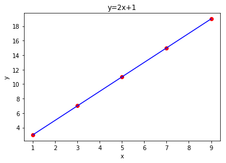
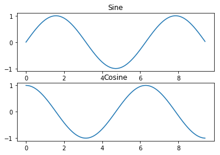
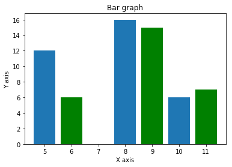

## NumPy 操作

+ 数组的算数和逻辑运算
+ 傅里叶变换和用于图形操作的例程
+ 与线性代数有关的操作。NumPy拥有线性代数和随机数生成的内置函数。

NumPy 通常与 SciPy（Scientific Python）和 Matplotlib（绘图库）一起使用。

### NumPy-Ndarry 对象

NumPy 中定义的最重要的对象是称为 `ndarray` 的 N 维数组类型。 它描述相同类型的元素集合。 可以使用基于零的索引访问集合中的项目。

```python
numpy.array(object, dtype = None, copy = True, order = None, subok = False, ndmin = 0)
a = np.array([1,2,3])
```
| 序号 | 参数及描述                                                   |
| ---- | ------------------------------------------------------------ |
| 1.   | `object` 任何暴露数组接口方法的对象都会返回一个数组或任何（嵌套）序列。 |
| 2.   | `dtype` 数组的所需数据类型，可选。                           |
| 3.   | `copy` 可选，默认为`true`，对象是否被复制。                  |
| 4.   | `order` `C`（按行）、`F`（按列）或`A`（任意，默认）。        |
| 5.   | `subok` 默认情况下，返回的数组被强制为基类数组。 如果为`true`，则返回子类。 |
| 6.   | `ndimin` 指定返回数组的最小维数。                            |

###  NumPy 数据类型

| 序号 | 数据类型及描述                                               |
| ---- | ------------------------------------------------------------ |
| 1.   | `bool_` 存储为一个字节的布尔值（真或假）                     |
| 2.   | `int_` 默认整数，相当于 C 的`long`，通常为`int32`或`int64`   |
| 3.   | `intc` 相当于 C 的`int`，通常为`int32`或`int64`              |
| 4.   | `intp` 用于索引的整数，相当于 C 的`size_t`，通常为`int32`或`int64` |
| 5.   | `int8` 字节（-128 ~ 127）                                    |
| 6.   | `int16` 16 位整数（-32768 ~ 32767）                          |
| 7.   | `int32` 32 位整数（-2147483648 ~ 2147483647）                |
| 8.   | `int64` 64 位整数（-9223372036854775808 ~ 9223372036854775807） |
| 9.   | `uint8` 8 位无符号整数（0 ~ 255）                            |
| 10.  | `uint16` 16 位无符号整数（0 ~ 65535）                        |
| 11.  | `uint32` 32 位无符号整数（0 ~ 4294967295）                   |
| 12.  | `uint64` 64 位无符号整数（0 ~ 18446744073709551615）         |
| 13.  | `float_` `float64`的简写                                     |
| 14.  | `float16` 半精度浮点：符号位，5 位指数，10 位尾数            |
| 15.  | `float32` 单精度浮点：符号位，8 位指数，23 位尾数            |
| 16.  | `float64` 双精度浮点：符号位，11 位指数，52 位尾数           |
| 17.  | `complex_` `complex128`的简写                                |
| 18.  | `complex64` 复数，由两个 32 位浮点表示（实部和虚部）         |
| 19.  | `complex128` 复数，由两个 64 位浮点表示（实部和虚部）        |

数据类型对象描述了对应于数组的固定内存块的解释，取决于以下方面：

- 数据类型（整数、浮点或者 Python 对象）
- 数据大小
- **字节序（小端或大端）**
- 在结构化类型的情况下，字段的名称，每个字段的数据类型，和每个字段占用的内存块部分。
- 如果数据类型是子序列，它的形状和数据类型。

 字节顺序取决于数据类型的前缀`<`或`>`。 `<`意味着编码是小端（最小有效字节存储在最小地址中）。 `>`意味着编码是大端（最大有效字节存储在最小地址中）。

#### np.dtype()应用(结构化数据类型的使用)

```python
# 首先创建结构化数据类型。  
import numpy as np 
dt = np.dtype([('age',np.int8)])  
print dt 
```

```
[('age', 'i1')] 
```

将其应用在**ndarry**对象，比较下面两个实例

```python
import numpy as np 

dt = np.dtype([('age',np.int8)]) 
a = np.array([(10,),(20,),(30,)], dtype = dt)  
print a
```

```
[(10,) (20,) (30,)]
```

 ```python
# 文件名称可用于访问age列的内容
import numpy as np 

dt = np.dtype([('age',np.int8)]) 
a = np.array([(10,),(20,),(30,)], dtype = dt)  
print a['age']
 ```

```
[10 20 30]
```

定义student结构化数据类型

```python
import numpy as np

student=np.dtype([('name','a20'),('age','i1'),('masks','>f4')])
class_1 = np.array([('abc',21,50),('xyz',15,78)],dtype=student)
print(class_1)
print(class_1['age'],class_1['name'],class_1['masks'])
```

```
[(b'abc', 21, 50.) (b'xyz', 15, 78.)]
[21 15] [b'abc' b'xyz'] [50. 78.]
```

$\color \red FixMe：这里的输出结果怎么总是多个b$

每个内置类型都有一个唯一定义他的字符代码：

- `'b'`：布尔值
- `'i'`：符号整数
- `'u'`：无符号整数
- `'f'`：浮点
- `'c'`：复数浮点
- `'m'`：时间间隔
- `'M'`：日期时间
- `'O'`：Python 对象
- `'S', 'a'`：字节串
- `'U'`：Unicode
- `'V'`：原始数据（`void`）

### NumPy 数组特性

```python
# 这会调整数组大小  
import numpy as np 

a=np.array([1,2,3,4,5,6])
a.shape=(2,3)
print(a)
b = a.reshape(3,2)
print(b)
```

```
[[1 2 3]
 [4 5 6]]
[[1 2]
 [3 4]
 [5 6]]
```

```python
a.ndim() # 返回数组维度
a.itemsize() # 返回数组中每个元素的字节单位长度
np.shape() np.reshape() # 改变数组维度
```

```python
# np.flags() # 展示数组当前的标志
import numpy as np 
x = np.array([1,2,3,4,5])  
print x.flags
```

```
C_CONTIGUOUS : True 
F_CONTIGUOUS : True 
OWNDATA : True 
WRITEABLE : True 
ALIGNED : True 
UPDATEIFCOPY : False
```
#### np.flags() 
| 序号 | 属性及描述                                                   |
| ---- | ------------------------------------------------------------ |
| 1.   | `C_CONTIGUOUS (C)` 数组位于单一的、C 风格的连续区段内        |
| 2.   | `F_CONTIGUOUS (F)` 数组位于单一的、Fortran 风格的连续区段内  |
| 3.   | `OWNDATA (O)` 数组的内存从其它对象处借用                     |
| 4.   | `WRITEABLE (W)` 数据区域可写入。 将它设置为`flase`会锁定数据，使其只读 |
| 5.   | `ALIGNED (A)` 数据和任何元素会为硬件适当对齐                 |
| 6.   | `UPDATEIFCOPY (U)` 这个数组是另一数组的副本。当这个数组释放时，源数组会由这个数组中的元素更新 |

###  NumPy 数组创建 

####  np.empty()

创建指定形状和dtype的未初始化数组。使用以下构造函数：

```python
numpy.empty(shape, dtype = float, order = 'C')
```

构造器接受下列参数：

| 序号 | 参数及描述                                                   |
| ---- | ------------------------------------------------------------ |
| 1.   | `Shape` 空数组的形状，整数或整数元组                         |
| 2.   | `Dtype` 所需的输出数组类型，可选                             |
| 3.   | `Order` `'C'`为按行的 C 风格数组，`'F'`为按列的 Fortran 风格数组 |

 注意：构造的数组元素为随机数，因为他们未初始化。

####  np.zeros()

返回特定大小，以0填充的数组，默认类型为float

```python
numpy.zeros(shape, dtype = float, order = 'C')
```

构造器接受下列参数：

| 序号 | 参数及描述                                                   |
| ---- | ------------------------------------------------------------ |
| 1.   | `Shape` 空数组的形状，整数或整数元组                         |
| 2.   | `Dtype` 所需的输出数组类型，可选                             |
| 3.   | `Order` `'C'`为按行的 C 风格数组，`'F'`为按列的 Fortran 风格数组 |

 ####  np.ones()

```python
numpy.ones(shape, dtype = None, order = 'C')
```

构造器接受下列参数：

| 序号 | 参数及描述                                                   |
| ---- | ------------------------------------------------------------ |
| 1.   | `Shape` 空数组的形状，整数或整数元组                         |
| 2.   | `Dtype` 所需的输出数组类型，可选                             |
| 3.   | `Order` `'C'`为按行的 C 风格数组，`'F'`为按列的 Fortran 风格数组 |

###  NumPy 来自现有数据的数组

#### numpy.asarray()

**将列表，列表的元组，元组等返回为ndarray**

```python
numpy.asarray(a, dtype = None, order = None)
```

构造器接受下列参数：

| 序号 | 参数及描述                                                   |
| ---- | ------------------------------------------------------------ |
| 1.   | `a` 任意形式的输入参数，比如列表、列表的元组、元组、元组的元组、元组的列表 |
| 2.   | `dtype` 通常，输入数据的类型会应用到返回的`ndarray`          |
| 3.   | `order` `'C'`为按行的 C 风格数组，`'F'`为按列的 Fortran 风格数组 |

```python
# 设置了 dtype  
import numpy as np 

x =  [1,2,3] 
a = np.asarray(x, dtype =  float)  
print a
```

```
[ 1.  2.  3.]
```

```python
# 来自元组列表的 ndarray
import numpy as np 

x =  [(1,2,3),(4,5)] 
a = np.asarray(x)  
print a
```

```
[(1, 2, 3) (4, 5)]
```

####  numpy.frombuffer()

**将字符串返回为ndarray**

```python
numpy.frombuffer(buffer, dtype = float, count = -1, offset = 0)
```

构造器接受下列参数：

| 序号 | 参数及描述                                           |
| ---- | ---------------------------------------------------- |
| 1.   | `buffer` 任何暴露缓冲区借口的对象                    |
| 2.   | `dtype` 返回数组的数据类型，默认为`float`            |
| 3.   | `count` 需要读取的数据数量，默认为`-1`，读取所有数据 |
| 4.   | `offset` 需要读取的起始位置，默认为`0`               |

```python
import numpy as np 
s =  'Hello World' 
a = np.frombuffer(s, dtype =  'S1')  
print a
```

```
['H'  'e'  'l'  'l'  'o'  ' '  'W'  'o'  'r'  'l'  'd']
```

####  numpy.fromiter()

**将任何可迭代对象返回为一个ndarray**

```python
numpy.fromiter(iterable, dtype, count = -1)
```

构造器接受下列参数：

| 序号 | 参数及描述                                           |
| ---- | ---------------------------------------------------- |
| 1.   | `iterable` 任何可迭代对象                            |
| 2.   | `dtype` 返回数组的数据类型                           |
| 3.   | `count` 需要读取的数据数量，默认为`-1`，读取所有数据 |

```python
# 使用 range 函数创建列表对象  
import numpy as np 
list = range(5)  
print list
```

 ```
range(5)
[0,  1,  2,  3,  4]
 ```

```python
# 从列表中获得迭代器  
import numpy as np 
list = range(5) 
it = iter(list)  
# 使用迭代器创建 ndarray 
x = np.fromiter(it,dtype=float)
print(x)
```

$ \color \red fix me : 迭代器，输出结果不对$

###  NumPy 来自数值范围的数组

####  numpy.arange()

**返回给定开始截止和步长的ndarray**

```python
numpy.arange(start, stop, step, dtype)
```

构造器接受下列参数：

| 序号 | 参数及描述                                                   |
| ---- | ------------------------------------------------------------ |
| 1.   | `start` 范围的起始值，默认为`0`                              |
| 2.   | `stop` 范围的终止值（不包含）                                |
| 3.   | `step` 两个值的间隔，默认为`1`                               |
| 4.   | `dtype` 返回`ndarray`的数据类型，如果没有提供，则会使用输入数据的类型。 |

 ```python
import numpy as np
a = np.arange(2,10,2,dtype=np.float32)
print(a)
 ```

```
[2. 4. 6. 8.]
```

####  numpy.linspace()

**返回给定开始截止和个数的ndarray**

```python
numpy.linspace(start, stop, num, endpoint, retstep, dtype)
```

构造器接受下列参数：

| 序号 | 参数及描述                                                   |
| ---- | ------------------------------------------------------------ |
| 1.   | `start` 序列的起始值                                         |
| 2.   | `stop` 序列的终止值，如果`endpoint`为`true`，该值包含于序列中 |
| 3.   | `num` 要生成的等间隔样例数量，默认为`50`                     |
| 4.   | `endpoint` 序列中是否包含`stop`值，默认为`ture`              |
| 5.   | `retstep` 如果为`true`，返回样例，以及连续数字之间的步长     |
| 6.   | `dtype` 输出`ndarray`的数据类型                              |

```python
import numpy as np
a = np.linspace(10,20,3)
print(a)
a = np.linspace(10,20,3,endpoint=False,retstep=True)
print(a)
```

```
[10. 15. 20.]
(array([10.        , 13.33333333, 16.66666667]), 3.3333333333333335)
```

####  numpy.logspace()

**与linespace(线性空间)对应为对数刻度上的ndarray**

```python
numpy.logspace(start, stop, num, endpoint, base, dtype)
```

`logspace`函数的输出由以下参数决定：

| 序号 | 参数及描述                                                 |
| ---- | ---------------------------------------------------------- |
| 1.   | `start` 起始值是`base ** start`                            |
| 2.   | `stop` 终止值是`base ** stop`                              |
| 3.   | `num` 范围内的数值数量，默认为`50`                         |
| 4.   | `endpoint` 如果为`true`，终止值包含在输出数组当中          |
| 5.   | `base` 对数空间的底数，默认为`10`                          |
| 6.   | `dtype` 输出数组的数据类型，如果没有提供，则取决于其它参数 |

 ###  NumPy 切片和索引

`ndarray`对象的内容可以通过索引或切片来访问和修改，就像 Python 的内置容器对象一样。

如前所述，`ndarray`对象中的元素遵循基于零的索引。 有三种可用的索引方法类型： **字段访问，基本切片**和**高级索引**。

基本切片是 Python 中基本切片概念到 n 维的扩展。 通过将`start`，`stop`和`step`参数提供给内置的`slice`函数来构造一个 Python `slice`对象。 此`slice`对象被传递给数组来提取数组的一部分。


```python
import numpy as np
a = np.arange(10)
s = slice(2,7,2)  
print a[s]
```

输出如下：

```
[2  4  6]
```

在上面的例子中，`ndarray`对象由`arange()`函数创建。 然后，分别用起始，终止和步长值`2`，`7`和`2`定义切片对象。 当这个切片对象传递给`ndarray`时，会对它的一部分进行切片，从索引`2`到`7`，步长为`2`。

通过将由冒号分隔的切片参数（`start:stop:step`）直接提供给`ndarray`对象，也可以获得相同的结果。

```
import numpy as np
a = np.arange(10)
b = a[2:7:2]  
print b
```

输出如下：

```
[2  4  6]
```

如果只输入一个参数，则将返回与索引对应的单个项目。 如果使用`a:`，则从该索引向后的所有项目将被提取。 如果使用两个参数（以`:`分隔），则对两个索引（不包括停止索引）之间的元素以默认步骤进行切片。

```python
import numpy as np 
c=np.array([[1,2,3],[4,5,6],[7,8,9]])
print(c)
print(c[1,...])
print(c[1:,...])
print(c[...,1:])
```

```
[[1 2 3]
 [4 5 6]
 [7 8 9]]
[4 5 6]
[[4 5 6]
 [7 8 9]]
[[2 3]
 [5 6]
 [8 9]]
```


```python
import numpy as np 
a = np.arange(10)
print(a)
```

    [0 1 2 3 4 5 6 7 8 9]


```python
a = np.array([[1,2,3],[4,5,6],[7,8,9]])
print(a)
```

    [[1 2 3]
     [4 5 6]
     [7 8 9]]


```python
print(a[1,...])
print(a[...,1])
```

    [4 5 6]
    [2 5 8]


### 高级索引
高级索引和切片是不同的，切片只是一个视图，高级索引返回数据的副本。


```python
import numpy as np 
x = np.array([[1,2,3],[3,4,5],[6,7,8],[9,10,11]])
print('origin array is : ',x)
z=x[1:4,1:3]
print('切片后的数组为：',z)
y=x[1:4,[1,2]]
print('高级索引后的数组为:',y)
```

    origin array is :  [[ 1  2  3]
     [ 3  4  5]
     [ 6  7  8]
     [ 9 10 11]]
    切片后的数组为： [[ 4  5]
     [ 7  8]
     [10 11]]
    高级索引后的数组为: [[ 4  5]
     [ 7  8]
     [10 11]]


###  布尔索引


```python
import  numpy as np 
a = np.array([[1,2,3],[4,5,6],[7,8,9]])
print(a[a>5])
```

    [6 7 8 9]


## NumPy - 广播
术语广播是指 NumPy 在算术运算期间处理不同形状的数组的能力。 对数组的算术运算通常在相应的元素上进行。 如果两个阵列具有完全相同的形状，则这些操作被无缝执行。

## Numpy - 数组上的迭代
迭代器对象：numpy.nditer


```python
import numpy as np 
a = np.arange(0,60,5)
a=a.reshape(3,4)
print('origin array is :\n',a)
print('\n')
print('迭代结果是：\n')
for x in np.nditer(a):
    print(x)   
```

    origin array is :
     [[ 0  5 10 15]
     [20 25 30 35]
     [40 45 50 55]]


​    
    迭代结果是：
    
    0
    5
    10
    15
    20
    25
    30
    35
    40
    45
    50
    55


```python
b=a.T
print('a的转置是:\n',b)
for x in np.nditer(b):
    print(x)
```

    a的转置是:
     [[ 0 20 40]
     [ 5 25 45]
     [10 30 50]
     [15 35 55]]
    0
    5
    10
    15
    20
    25
    30
    35
    40
    45
    50
    55


**对比上面不同的结果，体会迭代顺序的不同**


```python
c=b.copy(order='C')
f=b.copy(order='F')
print('format is c:\n')
for x in np.nditer(c):
    print(x)
print('format is F:\n')
for x in np.nditer(f):
    print(x)
```

    format is c:
    
    0
    20
    40
    5
    25
    45
    10
    30
    50
    15
    35
    55
    format is F:
    
    0
    5
    10
    15
    20
    25
    30
    35
    40
    45
    50
    55


```python
for x in np.nditer(b,order = 'C'):
    print(x)
```

    0
    20
    40
    5
    25
    45
    10
    30
    50
    15
    35
    55


### 迭代器修改数组的值
op_flags


```python
for x in np.nditer(a,op_flags=['readwrite']):
    x[...]=2*x
print(a)
```

    [[  0  10  20  30]
     [ 40  50  60  70]
     [ 80  90 100 110]]


### 外部循环
**参数及描述**
1.	c_index 可以跟踪 C 顺序的索引
   .	f_index 可以跟踪 Fortran 顺序的索引
   .	multi-index 每次迭代可以跟踪一种索引类型
   .	external_loop 给出的值是具有多个值的一维数组，而不是零维数组

### 广播迭代
如果两个数组是可广播的，nditer迭代器可以同时迭代他们


```python
import numpy as np 
a=np.arange(0,60,5)
a=a.reshape(3,4)
b=np.array([1,2,3,4])
for x,y in np.nditer([a,b]):
    print(x,y)
```

    0 1
    5 2
    10 3
    15 4
    20 1
    25 2
    30 3
    35 4
    40 1
    45 2
    50 3
    55 4


### Numpy - 数组操作
用于处理ndarray对象中的元素

#### numpy.reshape() 
不改变数据的情况下，改变形状
#### numpy.ndarray.flat()
返回数组上的一维迭代器
#### numpy.ndarray.flatten()
返回折叠为一维的数组副本，函数接受order参数
+ order：'C'--按行 'F'--列　'A'--原顺序　'k'--元素在内存中出现的顺序
#### numpy.ravel()
返回展开的一维数组，函数接受两个参数
+ order：'C'--按行 'F'--列　'A'--原顺序　'k'--元素在内存中出现的顺序


```python
a=np.arange(8).reshape(2,4)
print(a.flat[5])
print(a.flat[4])
```

    5
    4


```python
print(a.flatten())
print(a.flatten(order='C'))
print(a.flatten(order='F'))
print(a.flatten(order='A'))
```

    [0 1 2 3 4 5 6 7]
    [0 1 2 3 4 5 6 7]
    [0 4 1 5 2 6 3 7]
    [0 1 2 3 4 5 6 7]


```python
print(a.ravel())
```

    [0 1 2 3 4 5 6 7]


### 数组的翻转操作
操作及描述
1.	transpose 翻转数组的维度
   .	ndarray.T 和self.transpose()相同
   .	rollaxis 向后滚动指定的轴
   .	swapaxes 互换数组的两个轴


```python
a=np.arange(8).reshape(2,4)
print(a)
print(a.T)
```

    [[0 1 2 3]
     [4 5 6 7]]
    [[0 4]
     [1 5]
     [2 6]
     [3 7]]


```python
b=np.transpose(a)
print(b)
```

    [[0 4]
     [1 5]
     [2 6]
     [3 7]]


### 修改维度
维度和描述
1.	broadcast 产生模仿广播的对象
   .	broadcast_to 将数组广播到新形状
   .	expand_dims 扩展数组的形状
   .	squeeze 从数组的形状中删除单维条目

**np.expand_dims 和 np.squeeze 可以看做两个相反的操作，一个按照一定的轴扩充冗余的维度，一个删除冗余的维度**


```python
a=np.array([1,2,3,4])
print(np.broadcast_to(a,(4,4)))
```

    [[1 2 3 4]
     [1 2 3 4]
     [1 2 3 4]
     [1 2 3 4]]


### 数组的拼接
数组及描述
1.	concatenate 沿着现存的轴连接数据序列
   .	stack 沿着新轴连接数组序列
   .	hstack 水平堆叠序列中的数组（列方向）
   .	vstack 竖直堆叠序列中的数组（行方向）
    **连接的数组形状要相同**


```python
a=np.array([[1,2],[3,4]])
b=np.array([[5,6],[7,8]])
print(np.concatenate((a,b),0))
print(np.stack((a,b),0))
print(np.hstack((a,b)))
print(np.vstack((a,b)))
```

    [[1 2]
     [3 4]
     [5 6]
     [7 8]]
    [[[1 2]
      [3 4]]
    
     [[5 6]
      [7 8]]]
    [[1 2 5 6]
     [3 4 7 8]]
    [[1 2]
     [3 4]
     [5 6]
     [7 8]]


注意：stack只是堆叠了两个数组，其余三个最后生成的是一个数组

### 数组分割
数组及操作
1.	split 将一个数组分割为多个子数组
   .	hsplit 将一个数组水平分割为多个子数组（按列）
   .	vsplit 将一个数组竖直分割为多个子数组（按行）


```python
import numpy as np
a=np.arange(16).reshape(4,4)
b=np.split(a,4)
c=np.hsplit(a,2)
d=np.vsplit(a,2)
print(a)
print(b)
print(c)
print(d)
```

    [[ 0  1  2  3]
     [ 4  5  6  7]
     [ 8  9 10 11]
     [12 13 14 15]]
    [array([[0, 1, 2, 3]]), array([[4, 5, 6, 7]]), array([[ 8,  9, 10, 11]]), array([[12, 13, 14, 15]])]
    [array([[ 0,  1],
           [ 4,  5],
           [ 8,  9],
           [12, 13]]), array([[ 2,  3],
           [ 6,  7],
           [10, 11],
           [14, 15]])]
    [array([[0, 1, 2, 3],
           [4, 5, 6, 7]]), array([[ 8,  9, 10, 11],
           [12, 13, 14, 15]])]


### 添加删除元素
元素及描述
1.	resize 返回指定形状的新数组
   .	append 将值添加到数组末尾
   .	insert 沿指定轴将值插入到指定下标之前
   .	delete 返回删掉某个轴的子数组的新数组
   .	unique 寻找数组内的唯一元素


```python
a=np.array([[1,2,3],[4,5,6]])
b=np.resize(a,(3,2))
c=np.resize(a,(3,3))
d=np.resize(a,(4,3))
print(a)
print(a.shape)
print(b)
print(b.shape)
print(c)
print(c.shape)
print(d)
```

    [[1 2 3]
     [4 5 6]]
    (2, 3)
    [[1 2]
     [3 4]
     [5 6]]
    (3, 2)
    [[1 2 3]
     [4 5 6]
     [1 2 3]]
    (3, 3)
    [[1 2 3]
     [4 5 6]
     [1 2 3]
     [4 5 6]]


```python
import numpy as np
a=np.array([[1,2,3],[4,5,6]])
print(np.append(a,[7,8,9]))
print(np.append(a,[[7,8,9]],axis=0))
print(np.append(a,[[4,3,4],[7,8,9]],axis=1))
```

    [1 2 3 4 5 6 7 8 9]
    [[1 2 3]
     [4 5 6]
     [7 8 9]]
    [[1 2 3 4 3 4]
     [4 5 6 7 8 9]]


注意：如果没有提供axis参数，数组即那个会被展开，如果提供了axis参数，则添加的值维度必须和被添加的数组保持一致。


```python
a=np.array([[1,2],[3,4],[5,6]])
print(a)
print(np.insert(a,3,[11,23]))
print(np.insert(a,1,[11],axis=1))
print(np.insert(a,1,[22,33],axis=0))
```

    [[1 2]
     [3 4]
     [5 6]]
    [ 1  2  3 11 23  4  5  6]
    [[ 1 11  2]
     [ 3 11  4]
     [ 5 11  6]]
    [[ 1  2]
     [22 33]
     [ 3  4]
     [ 5  6]]


注意：该函数有着四个参数，同样如果未提供axis参数，数组将会被展开，在第二个参数对应的索引前插入值


```python
a=np.arange(12).reshape(3,4)
print(a)
print(np.delete(a,3))
print(np.delete(a,1,axis=0))
print(np.delete(a,2,axis=1))
print(np.delete(a,np.s_[::2]))

```

    [[ 0  1  2  3]
     [ 4  5  6  7]
     [ 8  9 10 11]]
    [ 0  1  2  4  5  6  7  8  9 10 11]
    [[ 0  1  2  3]
     [ 8  9 10 11]]
    [[ 0  1  3]
     [ 4  5  7]
     [ 8  9 11]]
    [ 1  3  5  7  9 11]


**注意：最后一个关于删除了所有二的倍数的值**

np.unique(arr, return_index, return_inverse, return_counts)

其中：

    arr：输入数组，如果不是一维数组则会展开 
    
    return_index：如果为true，返回输入数组中的元素下标
    
    return_inverse：如果为true，返回去重数组的下标，它可以用于重构输入数组
    
    return_counts：如果为true，返回去重数组中的元素在原数组中的出现次数


```python
a=np.array([1,2,2,3,7,9,2,4,6,4,3])
print(a)
print(np.unique(a))
print(np.unique(a,return_index=True))
print(np.unique(a,return_inverse=True))
u,counts=np.unique(a,return_counts=True)
print(counts)
print(np.unique(a,return_counts=True))
```

    [1 2 2 3 7 9 2 4 6 4 3]
    [1 2 3 4 6 7 9]
    (array([1, 2, 3, 4, 6, 7, 9]), array([0, 1, 3, 7, 8, 4, 5]))
    (array([1, 2, 3, 4, 6, 7, 9]), array([0, 1, 1, 2, 5, 6, 1, 3, 4, 3, 2]))
    [1 3 2 2 1 1 1]
    (array([1, 2, 3, 4, 6, 7, 9]), array([1, 3, 2, 2, 1, 1, 1]))


### Numpy 位操作
操作及描述
1.	bitwise_and 对数组元素执行位与操作
   .	bitwise_or 对数组元素执行位或操作
   .	invert 计算位非
   .	left_shift 向左移动二进制表示的位
   .	right_shift 向右移动二进制表示的位


```python
print(bin(13))
print(bin(17))
print(np.bitwise_and(13,17))
print(np.bitwise_or(13,17))
```

    0b1101
    0b10001
    1
    29


```python
print(np.invert(np.array([13],dtype=np.uint8))) #注意dtype有和没有的区别
print(np.binary_repr(13,width=8))  # 注意参数width
print(np.binary_repr(242,width=8))
```

    [242]
    00001101
    11110010


```python
print(np.binary_repr(10,width=8))
print(np.left_shift(10,4)) #　位向左移动4位，后面补零
print(np.binary_repr(160,width=8))
```

    00001010
    160
    10100000


```python
print(np.right_shift(40,2))
print(np.binary_repr(40,width=8))
```

    10
    00101000


## Numpy - 字符串函数
以下函数用于对dtype为numpy.string_或numpy.unicode_的数组执行向量化字符串操作。 它们基于 Python 内置库中的标准字符串函数。

函数及描述:
1.	add() 返回两个str或Unicode数组的逐个字符串连接
   .	multiply() 返回按元素多重连接后的字符串
   .	center() 返回给定字符串的副本，其中元素位于特定字符串的中央
   .	capitalize() 返回给定字符串的副本，其中只有第一个字符串大写
   .	title() 返回字符串或 Unicode 的按元素标题转换版本
   .	lower() 返回一个数组，其元素转换为小写
   .	upper() 返回一个数组，其元素转换为大写
   .	split() 返回字符串中的单词列表，并使用分隔符来分割
   .	splitlines() 返回元素中的行列表，以换行符分割
   0.	strip() 返回数组副本，其中元素移除了开头或者结尾处的特定字符
      .	join() 返回一个字符串，它是序列中字符串的连接
      .	replace() 返回字符串的副本，其中所有子字符串的出现位置都被新字符串取代
      .	decode() 按元素调用str.decode
      .	encode() 按元素调用str.encode

numpy.char类中的上述函数在执行向量化字符串操作时非常有用。


```python
print(np.char.add(['hello','abd'],[' hi',' xyz']))
```

    ['hello hi' 'abd xyz']


```python
print(np.char.multiply('hello ',3))
```

    hello hello hello 


```python
print(np.char.center('hello',10,fillchar='#'))
```

    ##hello###


```python
print(np.char.capitalize('huboni'))
```

    Huboni


```python
print(np.char.title('how old are you'))
```

    How Old Are You


```python
print(np.char.lower("HUBONI"))
```

    huboni


```python
print(np.char.upper('Huboni'))
```

    HUBONI


```python
print(np.char.split('how old are you'))
print(np.char.split('how old are you,Cindy?',sep=',')) ＃没有指定分隔符的情况下空格作为分隔符
```

    ['how', 'old', 'are', 'you']
    ['how old are you', 'Cindy?']


```python
print(np.char.strip('sakdus suhbns','s')) ＃　删除了开头或结尾
print(np.char.strip(['auha','ahuga','ahdec'],'a'))　＃　删除了开头和结尾
```

    akdus suhbn
    ['uh' 'hug' 'hdec']


```python
print(np.char.join(',','huboni'))
print(np.char.join([':',','],['huboni','cold']))
```

    h,u,b,o,n,i
    ['h:u:b:o:n:i' 'c,o,l,d']


```python
print(np.char.replace('he is a good man','is','was'))
print(np.char.replace(['he is a good boy','huboni is a girl'],['boy','huboni'],['man','Cindy']))
```

    he was a good man
    ['he is a good man' 'Cindy is a girl']


```python
a = np.char.encode('huboni','cp500')
print(a)
print(np.char.decode(a,'cp500'))
```

    b'\x88\xa4\x82\x96\x95\x89'
    huboni


### Numpy 算数函数
#### 三角函数


```python
a=np.array([0,30,45,60,90])
print(np.sin(a*np.pi/180))
print(np.cos(a*np.pi/180))
```

    [0.         0.5        0.70710678 0.8660254  1.        ]
    [1.00000000e+00 8.66025404e-01 7.07106781e-01 5.00000000e-01
     6.12323400e-17]


#### 舍入函数


```python
a=np.array([1.0,12.67,3.38])
print(np.around(a))
print(np.around(a,decimals=1))
print(np.around(a,decimals=-1)) # 要舍入的小数位数默认为０，如果为负整数将四舍五入到小数点左侧的位置
```

    [ 1. 13.  3.]
    [ 1.  12.7  3.4]
    [ 0. 10.  0.]


```python
print(np.floor(a)) # 返回不大于输入参数的最大整数值
```

    [ 1. 12.  3.]


```python
print(np.ceil(a)) # 返回输入值的上限
```

    [ 1. 13.  4.]


### NumPy - 算术运算
用于执行算术运算（如add()，subtract()，multiply()和divide()）的输入数组必须具有相同的形状或符合数组广播规则。


```python
a=np.arange(9).reshape(3,3)
b=np.array([10,10,10])
print(a)
print(b)
print(np.add(a,b))
print(np.subtract(a,b))
print(np.multiply(a,b))
print(np.divide(a,b))
```

    [[0 1 2]
     [3 4 5]
     [6 7 8]]
    [10 10 10]
    [[10 11 12]
     [13 14 15]
     [16 17 18]]
    [[-10  -9  -8]
     [ -7  -6  -5]
     [ -4  -3  -2]]
    [[ 0 10 20]
     [30 40 50]
     [60 70 80]]
    [[0.  0.1 0.2]
     [0.3 0.4 0.5]
     [0.6 0.7 0.8]]


```python
a=np.array([1,0,0.25,100,1.33])　# 对于整数０发出溢出警告
print(np.reciprocal(a))　# 函数返回参数逐元素的倒数
b=np.array([100],np.int16)
print(np.reciprocal(b)) # 对于绝对值大于１的整数元素结果始终为０
```

    [1.              inf 4.        0.01      0.7518797]
    [0]


    /usr/local/lib/python3.5/dist-packages/ipykernel_launcher.py:2: RuntimeWarning: divide by zero encountered in reciprocal


```python
a=np.array([1,10,100])
print(np.power(a,2))
b=np.array([1,2,3])
print(np.power(a,b))
```

    [    1   100 10000]
    [      1     100 1000000]


```python
a=np.array([10,20,20])
b=np.array([2,3,7])
print(np.mod(a,b))
print(np.remainder(a,b))
```

    [0 2 6]
    [0 2 6]


以下函数用于对含有复数的数组执行操作。

    numpy.real() 返回复数类型参数的实部。
    
    numpy.imag() 返回复数类型参数的虚部。
    
    numpy.conj() 返回通过改变虚部的符号而获得的共轭复数。
    
    numpy.angle() 返回复数参数的角度。 函数的参数是degree。 如果为true，返回的角度以角度制来表示，否则为以弧度制来表示。


```python
a=np.array([1j,2,0.5j+1,4j-2])
print(a)
print(np.real(a))
print(np.imag(a))
print(np.angle(a)) #　弧度制表示
print(np.angle(a,deg=True))　# deg 参数为True　返回角度制表示
```

    [ 0.+1.j   2.+0.j   1.+0.5j -2.+4.j ]
    [ 0.  2.  1. -2.]
    [1.  0.  0.5 4. ]
    [1.57079633 0.         0.46364761 2.03444394]
    [ 90.           0.          26.56505118 116.56505118]


### NumPy - 统计函数
用于从数组元素中查找最小，最大，标准差和方差等。


```python
a=np.array([[1,2,3],[4,5,6],[7,8,9]])
print(a)
print(np.amin(a))
print(np.amin(a,0))
print(np.amin(a,1))
print(np.amax(a))
print(np.amax(a,axis=0))
```

    [[1 2 3]
     [4 5 6]
     [7 8 9]]
    1
    [1 2 3]
    [1 4 7]
    9
    [7 8 9]


```python
print(np.ptp(a))
print(np.ptp(a,axis=0))
print(np.ptp(a,axis=1))
```

    8
    [6 6 6]
    [2 2 2]


```python
a=np.array([[1,2,3],[4,6,6],[7,8,9]])
print(a)
print(np.percentile(a,50))
print(np.percentile(a,50,axis=0))
print(np.percentile(a,50,axis=1))  # 沿着轴１分别小于[2,5,8]的数所占的百分比为50
```

    [[1 2 3]
     [4 6 6]
     [7 8 9]]
    6.0
    [4. 6. 6.]
    [2. 6. 8.]


```python
print(np.median(a))
print(np.median(a,axis=0))
print(np.median(a,axis=1)) # 中值定义为将数据样本的上半部分与下半部分分开的值,结果为数组中现有的值
```

    6.0
    [4. 6. 6.]
    [2. 6. 8.]


```python
print(np.mean(a))
print(np.mean(a,axis=0))
print(np.mean(a,axis=1)) # 算术平均值，结果不一定为数组中现有的值
```

    5.111111111111111
    [4.         5.33333333 6.        ]
    [2.         5.33333333 8.        ]


```python
print(np.average(a))
wts = [1,2,3]
print(np.average(a,weights=wts,axis=0)) # 加权平均数，没有制定权重参数时为算术平均数
```

    5.111111111111111
    [5.         6.33333333 7.        ]


#### 标准差
标准差是与均值的偏差的平方的平均值的平方根。 标准差公式如下：

std = sqrt(mean((x - x.mean())**2))


```python
import numpy as np
a=np.array([1,2,3,4])
print(np.std(a))
```

    1.118033988749895


#### 方差

方差是偏差的平方的平均值，即mean((x - x.mean())** 2)。 换句话说，标准差是方差的平方根。


```python
print(np.var(a))
```

    1.25


### NumPy - 排序、搜索和计数函数

　种类	　　　　　　　　　　　　速度	　　　　　最坏情况	　　　工作空间	　　　　稳定性


'quicksort'（快速排序）	　　1	　　　　　　　O(n^2)	　　　　0	　　　　　否


'mergesort'（归并排序）	　　2	　　　　　　　O(n*log(n))	　~n/2	　　　　是


'heapsort'（堆排序）	　　　　　3	　　　　　　O(n*log(n))	　　0	　　　　　　否

sort()函数返回输入数组的排序副本。 它有以下参数：

numpy.sort(a, axis, kind, order)

axis:要排序的轴

kind:默认为'quicksort'

order:如果包含字段，则是要排序的字段


```python
import numpy as np
a=np.array([[1,2,3],[7,5,9],[6,4,8]])
print(a)
print(np.sort(a))
print(np.sort(a,axis=0))
print(np.sort(a,axis=1,kind='mergesort'))
```

    [[1 2 3]
     [7 5 9]
     [6 4 8]]
    [[1 2 3]
     [5 7 9]
     [4 6 8]]
    [[1 2 3]
     [6 4 8]
     [7 5 9]]
    [[1 2 3]
     [5 7 9]
     [4 6 8]]


```python
dt=np.dtype([('name','S10'),('age',int)])
a=np.array([('huboni',20),('cindy',22),('mike',10)],dtype=dt)
print(a)
print(np.sort(a,order='age'))
print(np.sort(a,order='name'))
```

    [(b'huboni', 20) (b'cindy', 22) (b'mike', 10)]
    [(b'mike', 10) (b'huboni', 20) (b'cindy', 22)]
    [(b'cindy', 22) (b'huboni', 20) (b'mike', 10)]


**numpy.argsort()**
对输入数组沿着指定轴排序，返回数据的索引数组


```python
a=np.array([2,1,3,4])
print(np.argsort(a))
print(a[np.argsort(a)])
for i in np.argsort(a):
    print(a[i])
```

    [1 0 2 3]
    [1 2 3 4]
    1
    2
    3
    4


**np.lexsort()** 
可以看做键－值执行间接排序


```python
name=('huboni','zhaoyong','zhangmi','xulei')
sex=('girl1','boy1','girl2','boy2')
ind=np.lexsort((sex,name))
print(ind)
print([name[i]+','+sex[i] for i in ind])
```

    [0 3 2 1]
    ['huboni,girl1', 'xulei,boy2', 'zhangmi,girl2', 'zhaoyong,boy1']


**np.argmin(),np.argmax()**


```python
a=np.array([[1,2,3],[4,6,15],[9,7,8]])
print(a)
print(np.argmax(a))
print(np.argmax(a,axis=0))
print(np.argmax(a,axis=1))
print(np.argmin(a,axis=0))
```

    [[ 1  2  3]
     [ 4  6 15]
     [ 9  7  8]]
    5
    [2 2 1]
    [2 2 0]
    [0 0 0]


```python
a=np.array([1,2,3,0,4])
print(a)
print(np.nonzero(a))
```

    [1 2 3 0 4]
    (array([0, 1, 2, 4]),)


```python
a=np.array([[1,3,2],[7,9,4],[8,5,6]])
print(a)
print(np.where(a>6))
print(a[np.where(a>6)])
```

    [[1 3 2]
     [7 9 4]
     [8 5 6]]
    (array([1, 1, 2]), array([0, 1, 0]))
    [7 9 8]


**np.extract()**


```python
print(a)
cond = np.mod(a,2)==0
print(cond)
print(np.extract(cond,a))
```

    [[1 3 2]
     [7 9 4]
     [8 5 6]]
    [[False False  True]
     [False False  True]
     [ True False  True]]
    [2 4 8 6]


#### NumPy - 字节交换

存储在计算机内存中的数据取决于 CPU 使用的架构。 它可以是小端（最小有效位存储在最小地址中）或大端（最小有效字节存储在最大地址中）

numpy.ndarray.byteswap()函数在两个表示：大端和小端之间切换。


```python
a=np.array([1,23,567],dtype=np.int)
print(a)
print(map(hex,a))
print(a.byteswap(True))
print(map(hex,a))
#FIXME
```

    [  1  23 567]
    <map object at 0x7fe4d8864898>
    [  72057594037927936 1657324662872342528 3963730622039457792]
    <map object at 0x7fe4d881fb70>


#### NumPy - 副本和视图
在执行函数时，其中一些返回输入数组的副本，而另一些返回视图。 当内容物理存储在另一个位置时，称为副本。 另一方面，如果提供了相同内存内容的不同视图，我们将其称为视图。

##### 无复制

简单的赋值不会创建数组对象的副本。 相反，它使用原始数组的相同id()来访问它。 id()返回 Python 对象的通用标识符，类似于 C 中的指针。

此外，一个数组的任何变化都反映在另一个数组上。 例如，一个数组的形状改变也会改变另一个数组的形状。


```python
a=np.arange(9)
print(a)
print(id(a))
b=a
print(b)
print(id(b))
b.shape = (3,3)
print(b)
print(a)
```

    [0 1 2 3 4 5 6 7 8]
    140620863252880
    [0 1 2 3 4 5 6 7 8]
    140620863252880
    [[0 1 2]
     [3 4 5]
     [6 7 8]]
    [[0 1 2]
     [3 4 5]
     [6 7 8]]


##### 视图或浅复制


```python
a=np.arange(6).reshape(3,2)
print(a)
b=a.view()
print(b)
print(id(a))
print(id(b))
b.shape = 2,3
print(b)
print(a)
```

    [[0 1]
     [2 3]
     [4 5]]
    [[0 1]
     [2 3]
     [4 5]]
    140620862671808
    140620862672048
    [[0 1 2]
     [3 4 5]]
    [[0 1]
     [2 3]
     [4 5]]


视图ｉｄ不同，不会更改维数，数组的切片也会创建视图

##### 深复制
ndarray.copy()函数创建一个深层副本。 它是数组及其数据的完整副本，不与原始数组共享。


```python
a=np.array([[1,3,2],[9,8,6],[4,5,7]])
print(a)
print(id(a))
b=a.copy()
print(b)
print(id(b))
b[0,0]=100
print(b)
print(a)
```

    [[1 3 2]
     [9 8 6]
     [4 5 7]]
    140620863252320
    [[1 3 2]
     [9 8 6]
     [4 5 7]]
    140620862706512
    [[100   3   2]
     [  9   8   6]
     [  4   5   7]]
    [[1 3 2]
     [9 8 6]
     [4 5 7]]


### NumPy - 矩阵库
NumPy 包包含一个 Matrix库numpy.matlib。此模块的函数返回矩阵而不是返回ndarray对象。

**NumPy.matlib.empty(shape,dtype,order)**
返回一个新的矩阵,不初始化元素


```python
import numpy as np
import numpy.matlib
a=np.matlib.empty((2,2),dtype=np.int)
print(a)
```

    [[2 5]
     [6 8]]


```python
print(np.matlib.zeros((2,2)))
```

    [[0. 0.]
     [0. 0.]]


```python
print(np.matlib.ones((2,2)))
```

    [[1. 1.]
     [1. 1.]]


**np.matlib.eye(n,M,k,dtype)**

参数及描述

1. n 返回矩阵的行数

   .	M 返回矩阵的列数，默认为n

   .	k 对角线的索引


```python
print(np.matlib.eye(n=3,M=3,k=0))
```

    [[1. 0. 0.]
     [0. 1. 0.]
     [0. 0. 1.]]


```python
print(np.matlib.identity(5)) #返回指定大小的单位矩阵
```

    [[1. 0. 0. 0. 0.]
     [0. 1. 0. 0. 0.]
     [0. 0. 1. 0. 0.]
     [0. 0. 0. 1. 0.]
     [0. 0. 0. 0. 1.]]


```python
print(np.matlib.rand(3,2)) # 返回指定大小随机矩阵
```

    [[0.28580507 0.011323  ]
     [0.14572677 0.63082809]
     [0.121407   0.90529763]]


矩阵是二维的，而ndarray是一个n维数组，两个对象还可以互换的。


```python
a = np.matrix('1,2;3,4')
print(a) #　FIXME
```

    [[1 2]
     [3 4]]


### NumPy - 线性代数
**numpy.linalg**
函数及描述
1.	dot 两个数组的点积,矩阵乘法
   .	vdot 两个向量的点积,多维数组会被展开
   .	inner 两个数组的内积
   .	matmul 两个数组的矩阵积
   .	determinant 数组的行列式
   .	solve 求解线性矩阵方程
   .	inv 寻找矩阵的乘法逆矩阵


```python
a=np.array([[1,2],[3,4]])
b=np.array([[1,2],[3,4]])
print(a)
print(b)
print(np.inner(a,b))
```

    [[1 2]
     [3 4]]
    [[1 2]
     [3 4]]
    [[ 5 11]
     [11 25]]


```python
import numpy.matlib
import numpy as np

a=[[1,2],[0,1]]
b=[[1,3],[1,0]]
c=[1,2]
print(a)
print(b)
print(np.matmul(a,b))
print(np.matmul(a,c))
```

    [[1, 2], [0, 1]]
    [[1, 3], [1, 0]]
    [[3 3]
     [1 0]]
    [5 2]


```python
a=np.arange(8).reshape(2,2,2)
b=np.arange(4).reshape(2,2)
print(a)
print(b)
print(np.matmul(a,b))
```

    [[[0 1]
      [2 3]]
    
     [[4 5]
      [6 7]]]
    [[0 1]
     [2 3]]
    [[[ 2  3]
      [ 6 11]]
    
     [[10 19]
      [14 27]]]


numpy.matmul()函数返回两个数组的矩阵乘积。 虽然它返回二维数组的正常乘积，但如果任一参数的维数大于2，则将其视为存在于最后两个索引的矩阵的栈，并进行相应广播。


另一方面，如果任一参数是一维数组，则通过在其维度上附加 1 来将其提升为矩阵，并在乘法之后被去除。


```python
import numpy as np
a=np.array([[1,2],[3,3]])
print(np.linalg.det(a)) # 函数计算输入矩阵的行列式
```

    -3.0000000000000004


```python
# numpy.linalg.solve()函数给出了矩阵形式的线性方程的解。
# numpy.linalg.inv()函数来计算矩阵的逆。 矩阵的逆是这样的，如果它乘以原始矩阵，则得到单位矩阵
x=np.array([[1,2],[3,4]])
y=np.linalg.inv(x)
print(x)
print(y)
print(np.dot(x,y))
```

    [[1 2]
     [3 4]]
    [[-2.   1. ]
     [ 1.5 -0.5]]
    [[1.0000000e+00 0.0000000e+00]
     [8.8817842e-16 1.0000000e+00]]


### Numpy - Matplotlib
from matplotlib import pyplot as plt


```python
from matplotlib import pyplot as plt
x=np.arange(1,11,2)
y=2*x+1
plt.title('y=2x+1')
plt.xlabel('x')
plt.ylabel('y')
plt.plot(x,y,'or')
plt.plot(x,y,'b')
plt.show()
```





```python
import numpy as np 
import matplotlib.pyplot as plt 
# 计算正弦和余弦曲线上的点的 x 和 y 坐标 
x = np.arange(0,  3  * np.pi,  0.1) 
y_sin = np.sin(x) 
y_cos = np.cos(x)  
# 建立 subplot 网格，高为 2，宽为 1  
# 激活第一个 subplot
plt.subplot(2,  1,  1)  
# 绘制第一个图像 
plt.plot(x, y_sin) 
plt.title('Sine')  
# 将第二个 subplot 激活，并绘制第二个图像
plt.subplot(2,  1,  2) 
plt.plot(x, y_cos) 
plt.title('Cosine')  
# 展示图像
plt.show()

```





```python
from matplotlib import pyplot as plt 
x =  [5,8,10] 
y =  [12,16,6] 
x2 =  [6,9,11] 
y2 =  [6,15,7] 
plt.bar(x, y, align =  'center') 
plt.bar(x2, y2, color =  'g', align =  'center') 
plt.title('Bar graph') 
plt.ylabel('Y axis') 
plt.xlabel('X axis') 
plt.show()
```





### Numpy - IO


```python
#numpy.save()
#numpy.load()
#numpy.savetxt()
#numpy.loadtxt()
```


```python

```